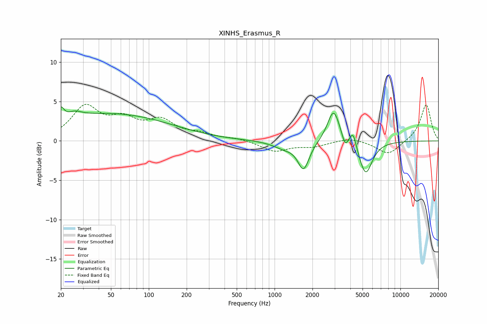

# XINHS_Erasmus_R
See [usage instructions](https://github.com/jaakkopasanen/AutoEq#usage) for more options and info.

### Parametric EQs
Apply preamp of -4.4 dB when using parametric equalizer.

|   # | Type    |   Fc (Hz) |    Q |   Gain (dB) |
|-----|---------|-----------|------|-------------|
|   1 | Peaking |        20 | 6    |         1.5 |
|   2 | Peaking |        26 | 2.52 |         0.7 |
|   3 | Peaking |        49 | 0.29 |         3.4 |
|   4 | Peaking |      1186 | 1.61 |        -0.8 |
|   5 | Peaking |      1699 | 3.13 |        -3.5 |
|   6 | Peaking |      2944 | 2.91 |         4.2 |
|   7 | Peaking |      3637 | 5.94 |        -1.4 |
|   8 | Peaking |      4044 | 4.7  |         0.4 |
|   9 | Peaking |      4226 | 6    |         1.6 |
|  10 | Peaking |      5290 | 2.67 |        -4.3 |

### Fixed Band EQs
When using fixed band (also called graphic) equalizer, apply preamp of **-4.7 dB** (if available) and set gains manually with these parameters.

|   # | Type    |   Fc (Hz) |    Q |   Gain (dB) |
|-----|---------|-----------|------|-------------|
|   1 | Peaking |        31 | 1.41 |         4.1 |
|   2 | Peaking |        62 | 1.41 |         2.3 |
|   3 | Peaking |       125 | 1.41 |         2.3 |
|   4 | Peaking |       250 | 1.41 |         0.7 |
|   5 | Peaking |       500 | 1.41 |         0.3 |
|   6 | Peaking |      1000 | 1.41 |        -1.3 |
|   7 | Peaking |      2000 | 1.41 |        -0.7 |
|   8 | Peaking |      4000 | 1.41 |         0.5 |
|   9 | Peaking |      8000 | 1.41 |        -1.8 |
|  10 | Peaking |     16000 | 1.41 |         4.7 |

### Graphs

