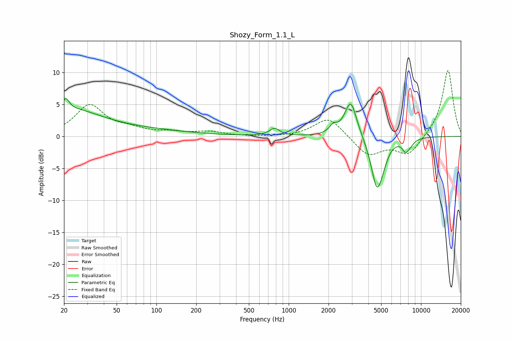

# Shozy_Form_1.1_L
See [usage instructions](https://github.com/jaakkopasanen/AutoEq#usage) for more options and info.

### Parametric EQs
Apply preamp of -6.0 dB when using parametric equalizer.

|   # | Type    |   Fc (Hz) |    Q |   Gain (dB) |
|-----|---------|-----------|------|-------------|
|   1 | Peaking |        21 | 5.28 |         1.9 |
|   2 | Peaking |        24 | 0.68 |         2.9 |
|   3 | Peaking |        31 | 0.18 |         1.2 |
|   4 | Peaking |       782 | 3.76 |         1.2 |
|   5 | Peaking |      2171 | 4.72 |         1.1 |
|   6 | Peaking |      2945 | 3.07 |         5.7 |
|   7 | Peaking |      4627 | 3.18 |        -7.5 |
|   8 | Peaking |      5124 | 3.52 |        -1.5 |
|   9 | Peaking |      7653 | 5.27 |        -1.6 |
|  10 | Peaking |      8312 | 4.3  |        -0.7 |

### Fixed Band EQs
When using fixed band (also called graphic) equalizer, apply preamp of **-10.4 dB** (if available) and set gains manually with these parameters.

|   # | Type    |   Fc (Hz) |    Q |   Gain (dB) |
|-----|---------|-----------|------|-------------|
|   1 | Peaking |        31 | 1.41 |         4.8 |
|   2 | Peaking |        62 | 1.41 |         0.9 |
|   3 | Peaking |       125 | 1.41 |         0.5 |
|   4 | Peaking |       250 | 1.41 |         0.7 |
|   5 | Peaking |       500 | 1.41 |        -0.1 |
|   6 | Peaking |      1000 | 1.41 |        -0.1 |
|   7 | Peaking |      2000 | 1.41 |         3.1 |
|   8 | Peaking |      4000 | 1.41 |        -3   |
|   9 | Peaking |      8000 | 1.41 |        -2.9 |
|  10 | Peaking |     16000 | 1.41 |        10.5 |

### Graphs

