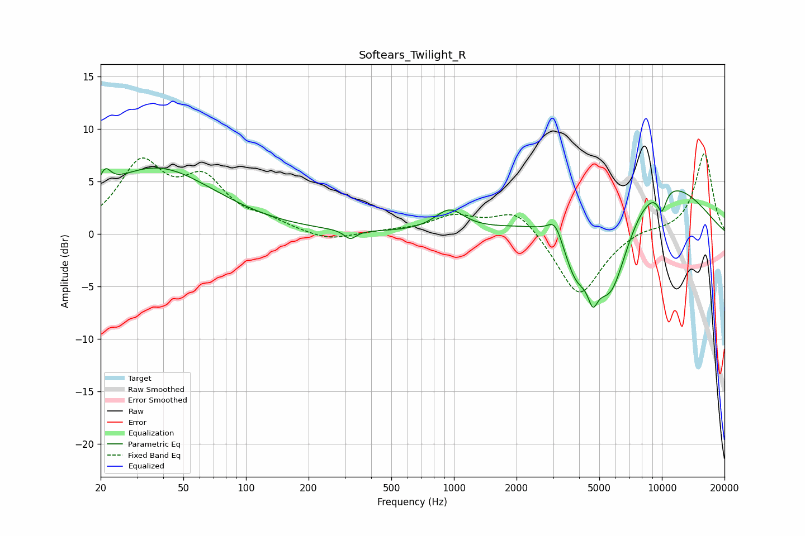

# Softears_Twilight_R
See [usage instructions](https://github.com/jaakkopasanen/AutoEq#usage) for more options and info.

### Parametric EQs
Apply preamp of -6.4 dB when using parametric equalizer.

|   # | Type    |   Fc (Hz) |    Q |   Gain (dB) |
|-----|---------|-----------|------|-------------|
|   1 | Peaking |        21 | 5.39 |         1.6 |
|   2 | Peaking |        37 | 0.5  |         6.2 |
|   3 | Peaking |       317 | 4.88 |        -0.9 |
|   4 | Peaking |       952 | 2.04 |         2   |
|   5 | Peaking |      3069 | 3.98 |         1.8 |
|   6 | Peaking |      3858 | 2.31 |        -4.1 |
|   7 | Peaking |      4656 | 5.85 |        -2.5 |
|   8 | Peaking |      5659 | 1.33 |       -10.7 |
|   9 | Peaking |      7995 | 0.42 |         7.2 |
|  10 | Peaking |     10000 | 5.33 |        -2.1 |

### Fixed Band EQs
When using fixed band (also called graphic) equalizer, apply preamp of **-7.8 dB** (if available) and set gains manually with these parameters.

|   # | Type    |   Fc (Hz) |    Q |   Gain (dB) |
|-----|---------|-----------|------|-------------|
|   1 | Peaking |        31 | 1.41 |         6.4 |
|   2 | Peaking |        62 | 1.41 |         4.6 |
|   3 | Peaking |       125 | 1.41 |         0.9 |
|   4 | Peaking |       250 | 1.41 |        -0.8 |
|   5 | Peaking |       500 | 1.41 |         0.2 |
|   6 | Peaking |      1000 | 1.41 |         1.6 |
|   7 | Peaking |      2000 | 1.41 |         2.5 |
|   8 | Peaking |      4000 | 1.41 |        -6.2 |
|   9 | Peaking |      8000 | 1.41 |         0.5 |
|  10 | Peaking |     16000 | 1.41 |         7.7 |

### Graphs

