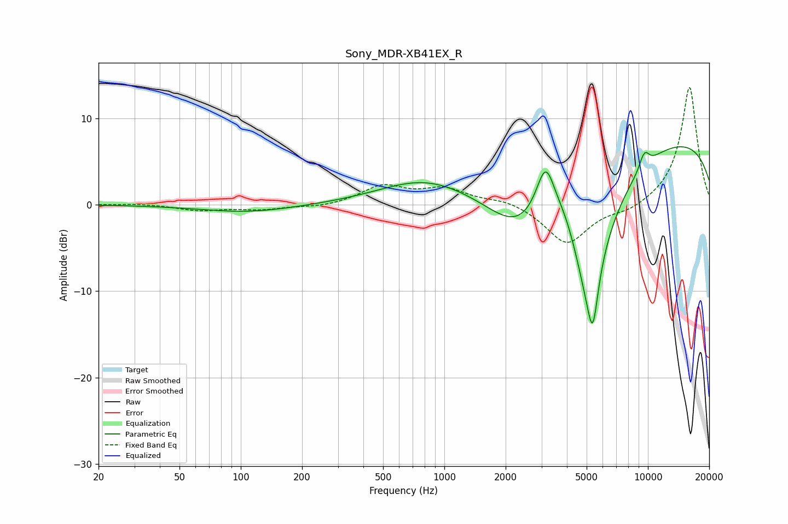

# Sony_MDR-XB41EX_R
See [usage instructions](https://github.com/jaakkopasanen/AutoEq#usage) for more options and info.

### Parametric EQs
Apply preamp of -6.8 dB when using parametric equalizer.

|   # | Type    |   Fc (Hz) |    Q |   Gain (dB) |
|-----|---------|-----------|------|-------------|
|   1 | Peaking |       108 | 0.62 |        -0.9 |
|   2 | Peaking |       789 | 0.64 |         2.7 |
|   3 | Peaking |      2289 | 0.87 |        -4.8 |
|   4 | Peaking |      3145 | 2.92 |         6.6 |
|   5 | Peaking |      3961 | 2.22 |         2.4 |
|   6 | Peaking |      5115 | 1.23 |       -16.3 |
|   7 | Peaking |      5361 | 5.75 |        -5.6 |
|   8 | Peaking |      9422 | 5.93 |         0.9 |
|   9 | Peaking |      9766 | 5.93 |         1   |
|  10 | Peaking |      9933 | 0.18 |         8.3 |

### Fixed Band EQs
When using fixed band (also called graphic) equalizer, apply preamp of **-13.7 dB** (if available) and set gains manually with these parameters.

|   # | Type    |   Fc (Hz) |    Q |   Gain (dB) |
|-----|---------|-----------|------|-------------|
|   1 | Peaking |        31 | 1.41 |         0.1 |
|   2 | Peaking |        62 | 1.41 |        -0.6 |
|   3 | Peaking |       125 | 1.41 |        -0.5 |
|   4 | Peaking |       250 | 1.41 |        -0.3 |
|   5 | Peaking |       500 | 1.41 |         2.1 |
|   6 | Peaking |      1000 | 1.41 |         1.7 |
|   7 | Peaking |      2000 | 1.41 |         0.6 |
|   8 | Peaking |      4000 | 1.41 |        -4.6 |
|   9 | Peaking |      8000 | 1.41 |        -0.8 |
|  10 | Peaking |     16000 | 1.41 |        13.8 |

### Graphs

