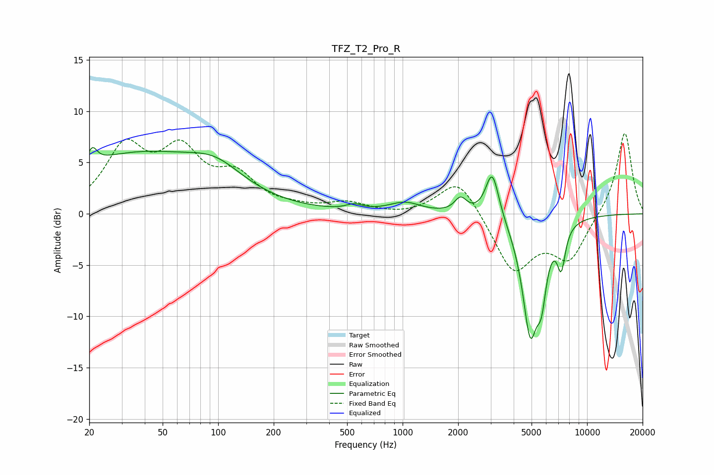

# TFZ_T2_Pro_R
See [usage instructions](https://github.com/jaakkopasanen/AutoEq#usage) for more options and info.

### Parametric EQs
Apply preamp of -6.6 dB when using parametric equalizer.

|   # | Type    |   Fc (Hz) |    Q |   Gain (dB) |
|-----|---------|-----------|------|-------------|
|   1 | Peaking |        21 | 5.8  |         1.5 |
|   2 | Peaking |        36 | 0.34 |         5.7 |
|   3 | Peaking |        97 | 0.98 |         2   |
|   4 | Peaking |       548 | 3.23 |         0.5 |
|   5 | Peaking |      1029 | 1.63 |         1   |
|   6 | Peaking |      2063 | 4.31 |         1.4 |
|   7 | Peaking |      3063 | 3.86 |         4.7 |
|   8 | Peaking |      4919 | 3.11 |       -11.2 |
|   9 | Peaking |      5665 | 5.36 |        -4.2 |
|  10 | Peaking |      7243 | 5.99 |        -3.8 |

### Fixed Band EQs
When using fixed band (also called graphic) equalizer, apply preamp of **-7.9 dB** (if available) and set gains manually with these parameters.

|   # | Type    |   Fc (Hz) |    Q |   Gain (dB) |
|-----|---------|-----------|------|-------------|
|   1 | Peaking |        31 | 1.41 |         6.1 |
|   2 | Peaking |        62 | 1.41 |         5.4 |
|   3 | Peaking |       125 | 1.41 |         3.2 |
|   4 | Peaking |       250 | 1.41 |         0.4 |
|   5 | Peaking |       500 | 1.41 |         1   |
|   6 | Peaking |      1000 | 1.41 |        -0.2 |
|   7 | Peaking |      2000 | 1.41 |         3.7 |
|   8 | Peaking |      4000 | 1.41 |        -5.6 |
|   9 | Peaking |      8000 | 1.41 |        -4.3 |
|  10 | Peaking |     16000 | 1.41 |         8.1 |

### Graphs

