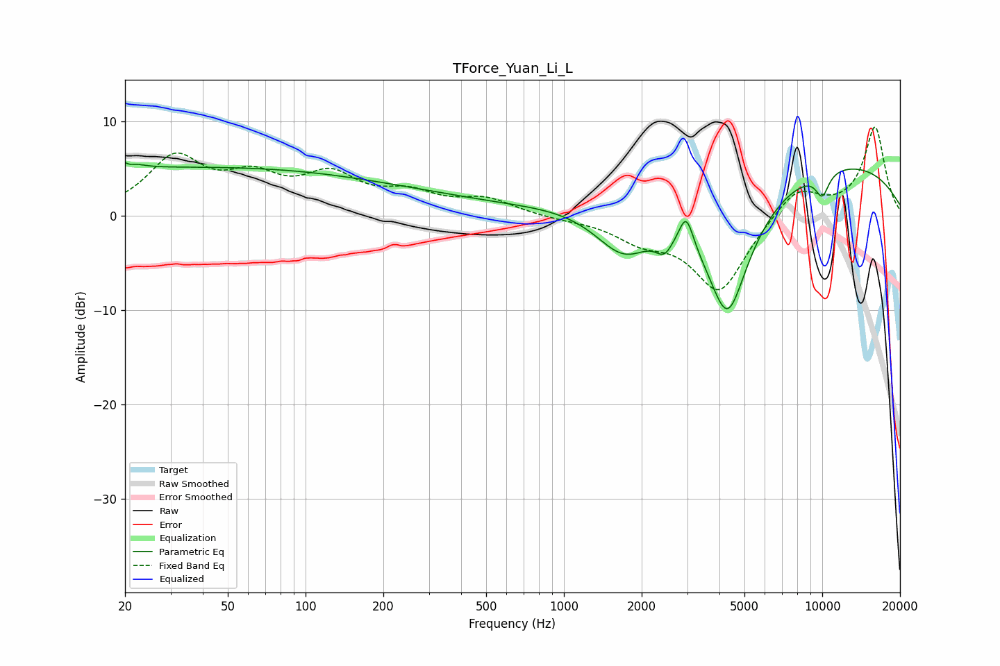

# TForce_Yuan_Li_L
See [usage instructions](https://github.com/jaakkopasanen/AutoEq#usage) for more options and info.

### Parametric EQs
Apply preamp of -5.7 dB when using parametric equalizer.

|   # | Type    |   Fc (Hz) |    Q |   Gain (dB) |
|-----|---------|-----------|------|-------------|
|   1 | Peaking |        21 | 4.87 |         3.5 |
|   2 | Peaking |        21 | 5.73 |        -3   |
|   3 | Peaking |        24 | 0.19 |         4.8 |
|   4 | Peaking |       200 | 0.39 |         2   |
|   5 | Peaking |      1716 | 1.18 |        -6   |
|   6 | Peaking |      2449 | 4.23 |        -1.9 |
|   7 | Peaking |      2976 | 5.15 |         3.4 |
|   8 | Peaking |      4299 | 1.4  |       -15.5 |
|   9 | Peaking |      7252 | 0.19 |         6.7 |
|  10 | Peaking |     10000 | 4.6  |        -2.5 |

### Fixed Band EQs
When using fixed band (also called graphic) equalizer, apply preamp of **-9.5 dB** (if available) and set gains manually with these parameters.

|   # | Type    |   Fc (Hz) |    Q |   Gain (dB) |
|-----|---------|-----------|------|-------------|
|   1 | Peaking |        31 | 1.41 |         5.9 |
|   2 | Peaking |        62 | 1.41 |         3.4 |
|   3 | Peaking |       125 | 1.41 |         3.8 |
|   4 | Peaking |       250 | 1.41 |         2   |
|   5 | Peaking |       500 | 1.41 |         1.6 |
|   6 | Peaking |      1000 | 1.41 |        -0.3 |
|   7 | Peaking |      2000 | 1.41 |        -2.1 |
|   8 | Peaking |      4000 | 1.41 |        -8   |
|   9 | Peaking |      8000 | 1.41 |         3.2 |
|  10 | Peaking |     16000 | 1.41 |         9.4 |

### Graphs

