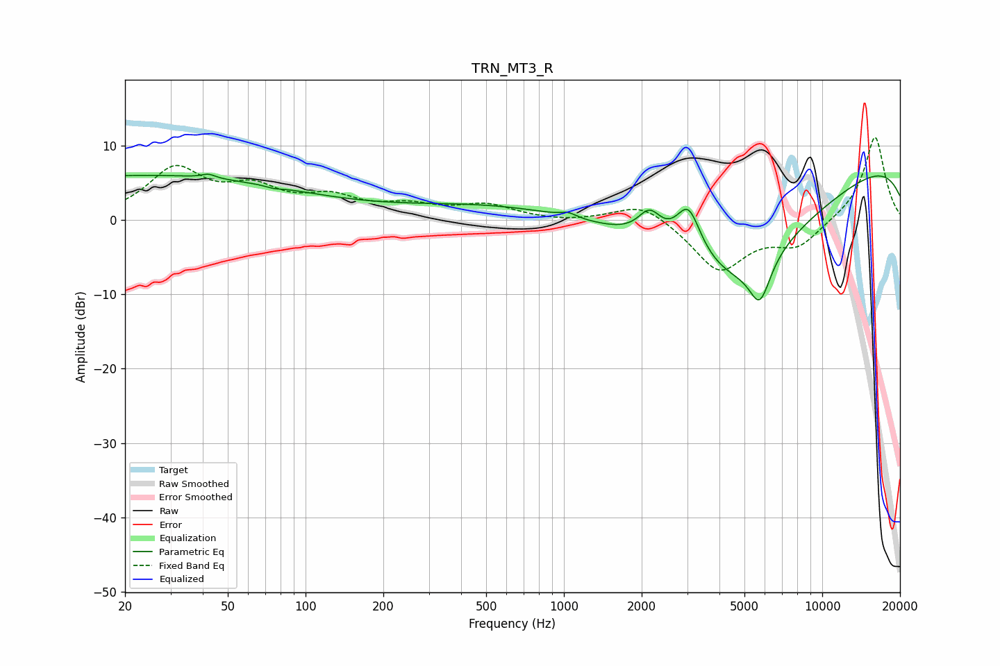

# TRN_MT3_R
See [usage instructions](https://github.com/jaakkopasanen/AutoEq#usage) for more options and info.

### Parametric EQs
Apply preamp of -6.2 dB when using parametric equalizer.

|   # | Type    |   Fc (Hz) |    Q |   Gain (dB) |
|-----|---------|-----------|------|-------------|
|   1 | Peaking |        23 | 0.21 |         6   |
|   2 | Peaking |        42 | 5.6  |         0.5 |
|   3 | Peaking |        75 | 4.94 |        -0.3 |
|   4 | Peaking |       719 | 0.34 |         2.6 |
|   5 | Peaking |      1042 | 4.56 |         0.6 |
|   6 | Peaking |      2146 | 3.14 |         3.5 |
|   7 | Peaking |      3035 | 2.85 |         6.7 |
|   8 | Peaking |      4541 | 0.42 |       -15.9 |
|   9 | Peaking |      5736 | 3.31 |        -5.8 |
|  10 | Peaking |     10000 | 0.18 |        10   |

### Fixed Band EQs
When using fixed band (also called graphic) equalizer, apply preamp of **-11.2 dB** (if available) and set gains manually with these parameters.

|   # | Type    |   Fc (Hz) |    Q |   Gain (dB) |
|-----|---------|-----------|------|-------------|
|   1 | Peaking |        31 | 1.41 |         6.5 |
|   2 | Peaking |        62 | 1.41 |         3.5 |
|   3 | Peaking |       125 | 1.41 |         2.6 |
|   4 | Peaking |       250 | 1.41 |         1.6 |
|   5 | Peaking |       500 | 1.41 |         1.8 |
|   6 | Peaking |      1000 | 1.41 |        -0.3 |
|   7 | Peaking |      2000 | 1.41 |         2.6 |
|   8 | Peaking |      4000 | 1.41 |        -6.8 |
|   9 | Peaking |      8000 | 1.41 |        -3.3 |
|  10 | Peaking |     16000 | 1.41 |        11.4 |

### Graphs

