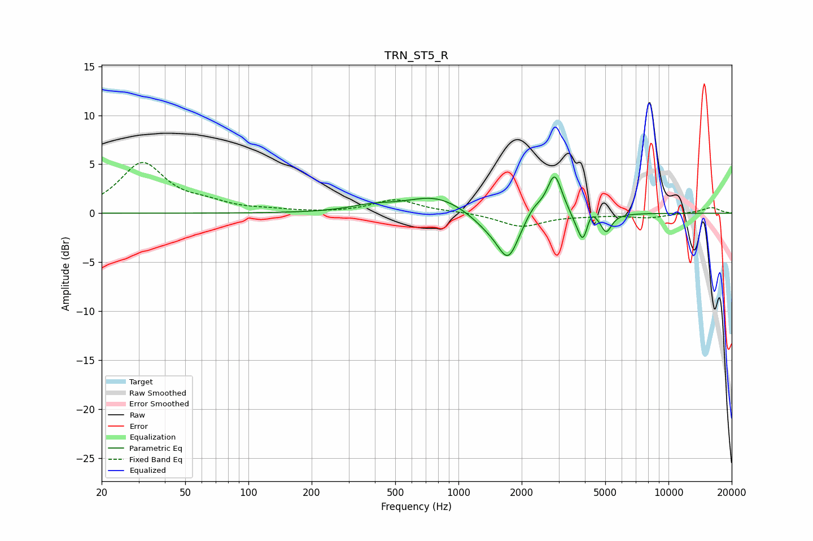

# TRN_ST5_R
See [usage instructions](https://github.com/jaakkopasanen/AutoEq#usage) for more options and info.

### Parametric EQs
Apply preamp of -3.8 dB when using parametric equalizer.

|   # | Type    |   Fc (Hz) |    Q |   Gain (dB) |
|-----|---------|-----------|------|-------------|
|   1 | Peaking |       386 | 1.33 |         0.6 |
|   2 | Peaking |       783 | 1.02 |         1.8 |
|   3 | Peaking |      1404 | 1.63 |        -1.4 |
|   4 | Peaking |      1728 | 2.8  |        -4.2 |
|   5 | Peaking |      2284 | 3.52 |         1   |
|   6 | Peaking |      2868 | 4.05 |         4.1 |
|   7 | Peaking |      3585 | 6    |        -0.5 |
|   8 | Peaking |      3914 | 5.87 |        -2.9 |
|   9 | Peaking |      4282 | 6    |         1.1 |
|  10 | Peaking |      5054 | 5.43 |        -1.9 |

### Fixed Band EQs
When using fixed band (also called graphic) equalizer, apply preamp of **-5.3 dB** (if available) and set gains manually with these parameters.

|   # | Type    |   Fc (Hz) |    Q |   Gain (dB) |
|-----|---------|-----------|------|-------------|
|   1 | Peaking |        31 | 1.41 |         5   |
|   2 | Peaking |        62 | 1.41 |         0.8 |
|   3 | Peaking |       125 | 1.41 |         0.2 |
|   4 | Peaking |       250 | 1.41 |        -0   |
|   5 | Peaking |       500 | 1.41 |         1.4 |
|   6 | Peaking |      1000 | 1.41 |         0.1 |
|   7 | Peaking |      2000 | 1.41 |        -1.4 |
|   8 | Peaking |      4000 | 1.41 |        -0.2 |
|   9 | Peaking |      8000 | 1.41 |        -0.4 |
|  10 | Peaking |     16000 | 1.41 |         0.6 |

### Graphs

