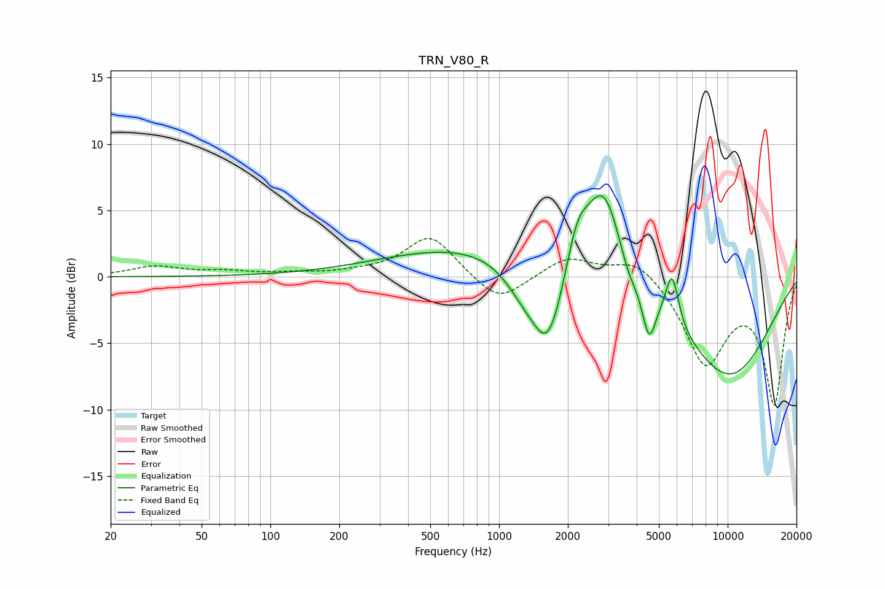

# TRN_V80_R
See [usage instructions](https://github.com/jaakkopasanen/AutoEq#usage) for more options and info.

### Parametric EQs
Apply preamp of -6.2 dB when using parametric equalizer.

|   # | Type    |   Fc (Hz) |    Q |   Gain (dB) |
|-----|---------|-----------|------|-------------|
|   1 | Peaking |       860 | 0.34 |         2.4 |
|   2 | Peaking |      1283 | 1.6  |        -2   |
|   3 | Peaking |      1644 | 1.93 |        -6.4 |
|   4 | Peaking |      2198 | 2.93 |         3   |
|   5 | Peaking |      2867 | 1.71 |         7   |
|   6 | Peaking |      3668 | 3.66 |        -1.2 |
|   7 | Peaking |      4528 | 4.71 |        -3.7 |
|   8 | Peaking |      5715 | 4.83 |         3.8 |
|   9 | Peaking |      6663 | 6    |        -0   |
|  10 | Peaking |     10000 | 0.56 |        -7.6 |

### Fixed Band EQs
When using fixed band (also called graphic) equalizer, apply preamp of **-3.0 dB** (if available) and set gains manually with these parameters.

|   # | Type    |   Fc (Hz) |    Q |   Gain (dB) |
|-----|---------|-----------|------|-------------|
|   1 | Peaking |        31 | 1.41 |         0.7 |
|   2 | Peaking |        62 | 1.41 |         0.3 |
|   3 | Peaking |       125 | 1.41 |         0.2 |
|   4 | Peaking |       250 | 1.41 |         0.2 |
|   5 | Peaking |       500 | 1.41 |         3.1 |
|   6 | Peaking |      1000 | 1.41 |        -2.1 |
|   7 | Peaking |      2000 | 1.41 |         1.5 |
|   8 | Peaking |      4000 | 1.41 |         1.6 |
|   9 | Peaking |      8000 | 1.41 |        -6.4 |
|  10 | Peaking |     16000 | 1.41 |        -9.4 |

### Graphs

