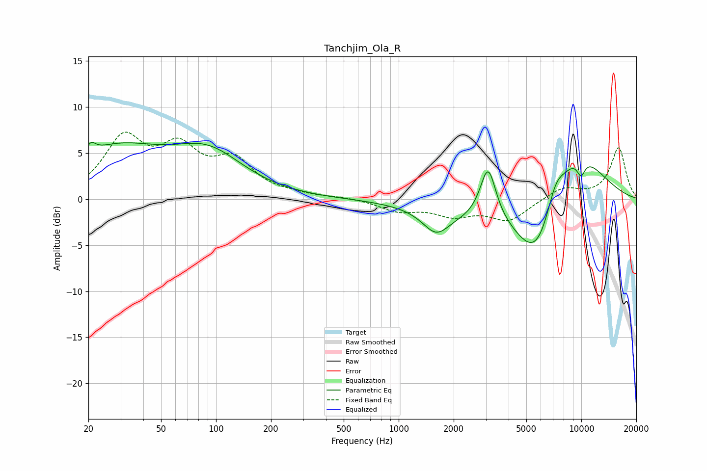

# Tanchjim_Ola_R
See [usage instructions](https://github.com/jaakkopasanen/AutoEq#usage) for more options and info.

### Parametric EQs
Apply preamp of -6.3 dB when using parametric equalizer.

|   # | Type    |   Fc (Hz) |    Q |   Gain (dB) |
|-----|---------|-----------|------|-------------|
|   1 | Peaking |        21 | 5.63 |         1.1 |
|   2 | Peaking |        28 | 0.54 |         5.1 |
|   3 | Peaking |        91 | 0.72 |         4.4 |
|   4 | Peaking |      1603 | 1.92 |        -2.5 |
|   5 | Peaking |      2501 | 0.54 |        -1.4 |
|   6 | Peaking |      3087 | 3.22 |         6   |
|   7 | Peaking |      5747 | 1.11 |        -8   |
|   8 | Peaking |      7183 | 2.65 |         2.7 |
|   9 | Peaking |      9291 | 0.8  |         6.4 |
|  10 | Peaking |      9963 | 5.16 |        -1.7 |

### Fixed Band EQs
When using fixed band (also called graphic) equalizer, apply preamp of **-7.4 dB** (if available) and set gains manually with these parameters.

|   # | Type    |   Fc (Hz) |    Q |   Gain (dB) |
|-----|---------|-----------|------|-------------|
|   1 | Peaking |        31 | 1.41 |         6.2 |
|   2 | Peaking |        62 | 1.41 |         4.7 |
|   3 | Peaking |       125 | 1.41 |         3.7 |
|   4 | Peaking |       250 | 1.41 |         0.3 |
|   5 | Peaking |       500 | 1.41 |         0.2 |
|   6 | Peaking |      1000 | 1.41 |        -1.2 |
|   7 | Peaking |      2000 | 1.41 |        -1.6 |
|   8 | Peaking |      4000 | 1.41 |        -2.2 |
|   9 | Peaking |      8000 | 1.41 |         1.3 |
|  10 | Peaking |     16000 | 1.41 |         5.6 |

### Graphs

