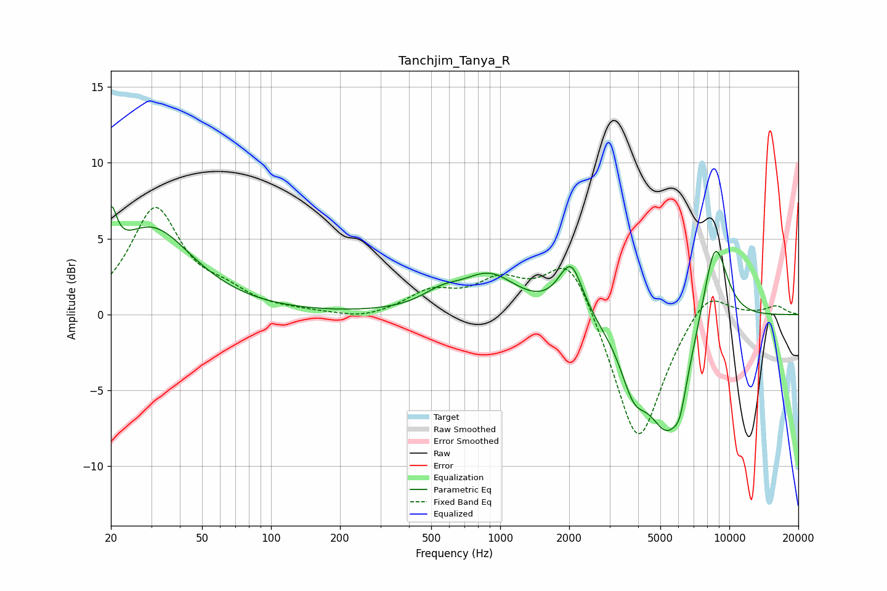

# Tanchjim_Tanya_R
See [usage instructions](https://github.com/jaakkopasanen/AutoEq#usage) for more options and info.

### Parametric EQs
Apply preamp of -7.2 dB when using parametric equalizer.

|   # | Type    |   Fc (Hz) |    Q |   Gain (dB) |
|-----|---------|-----------|------|-------------|
|   1 | Peaking |        20 | 5.71 |         3.2 |
|   2 | Peaking |        30 | 0.79 |         5.6 |
|   3 | Peaking |       554 | 1.63 |         0.9 |
|   4 | Peaking |       901 | 1.19 |         2.4 |
|   5 | Peaking |      1876 | 2.59 |         0.3 |
|   6 | Peaking |      2048 | 2.78 |         3.2 |
|   7 | Peaking |      3824 | 2.43 |        -3.1 |
|   8 | Peaking |      5393 | 1.49 |        -7.4 |
|   9 | Peaking |      6093 | 5.24 |        -1.4 |
|  10 | Peaking |      8640 | 2.3  |         6.1 |

### Fixed Band EQs
When using fixed band (also called graphic) equalizer, apply preamp of **-7.2 dB** (if available) and set gains manually with these parameters.

|   # | Type    |   Fc (Hz) |    Q |   Gain (dB) |
|-----|---------|-----------|------|-------------|
|   1 | Peaking |        31 | 1.41 |         6.9 |
|   2 | Peaking |        62 | 1.41 |         1.1 |
|   3 | Peaking |       125 | 1.41 |         0.1 |
|   4 | Peaking |       250 | 1.41 |        -0.4 |
|   5 | Peaking |       500 | 1.41 |         1.4 |
|   6 | Peaking |      1000 | 1.41 |         2   |
|   7 | Peaking |      2000 | 1.41 |         4.1 |
|   8 | Peaking |      4000 | 1.41 |        -8.9 |
|   9 | Peaking |      8000 | 1.41 |         2   |
|  10 | Peaking |     16000 | 1.41 |         0.6 |

### Graphs

