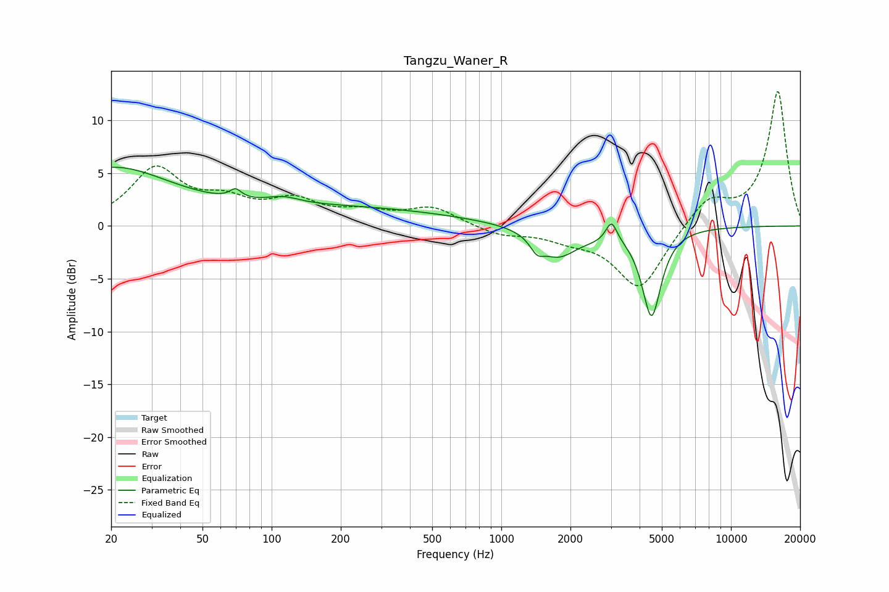

# Tangzu_Waner_R
See [usage instructions](https://github.com/jaakkopasanen/AutoEq#usage) for more options and info.

### Parametric EQs
Apply preamp of -5.7 dB when using parametric equalizer.

|   # | Type    |   Fc (Hz) |    Q |   Gain (dB) |
|-----|---------|-----------|------|-------------|
|   1 | Peaking |        20 | 0.54 |         5.3 |
|   2 | Peaking |        69 | 6    |        -1.8 |
|   3 | Peaking |        69 | 5.86 |         2.7 |
|   4 | Peaking |       112 | 2.04 |         0.6 |
|   5 | Peaking |       196 | 0.28 |         1.7 |
|   6 | Peaking |      1430 | 4.82 |        -1.2 |
|   7 | Peaking |      1766 | 1.69 |        -2.7 |
|   8 | Peaking |      2528 | 2.15 |        -0.4 |
|   9 | Peaking |      3018 | 6    |         1.9 |
|  10 | Peaking |      4509 | 3.38 |        -8.4 |

### Fixed Band EQs
When using fixed band (also called graphic) equalizer, apply preamp of **-12.8 dB** (if available) and set gains manually with these parameters.

|   # | Type    |   Fc (Hz) |    Q |   Gain (dB) |
|-----|---------|-----------|------|-------------|
|   1 | Peaking |        31 | 1.41 |         5.2 |
|   2 | Peaking |        62 | 1.41 |         1.9 |
|   3 | Peaking |       125 | 1.41 |         2.1 |
|   4 | Peaking |       250 | 1.41 |         1.1 |
|   5 | Peaking |       500 | 1.41 |         1.7 |
|   6 | Peaking |      1000 | 1.41 |        -0.8 |
|   7 | Peaking |      2000 | 1.41 |        -1   |
|   8 | Peaking |      4000 | 1.41 |        -6   |
|   9 | Peaking |      8000 | 1.41 |         2.6 |
|  10 | Peaking |     16000 | 1.41 |        12.8 |

### Graphs

