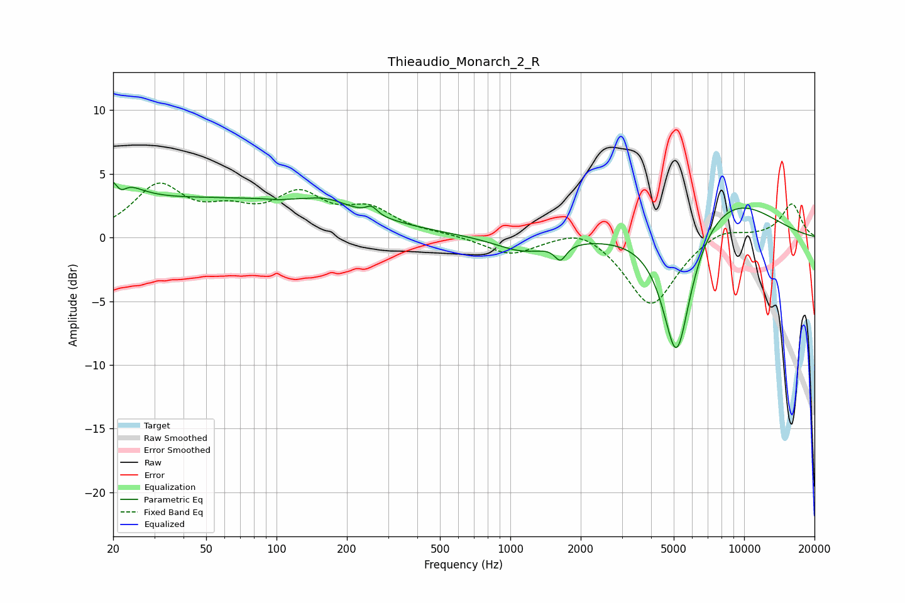

# Thieaudio_Monarch_2_R
See [usage instructions](https://github.com/jaakkopasanen/AutoEq#usage) for more options and info.

### Parametric EQs
Apply preamp of -4.4 dB when using parametric equalizer.

|   # | Type    |   Fc (Hz) |    Q |   Gain (dB) |
|-----|---------|-----------|------|-------------|
|   1 | Peaking |        20 | 1.83 |         2.8 |
|   2 | Peaking |        22 | 5.52 |        -1.2 |
|   3 | Peaking |        58 | 0.23 |         3   |
|   4 | Peaking |       101 | 5.94 |        -0.1 |
|   5 | Peaking |       164 | 1.51 |         0.8 |
|   6 | Peaking |       255 | 5.89 |         0.6 |
|   7 | Peaking |      1132 | 1.22 |        -1.2 |
|   8 | Peaking |      1638 | 5.88 |        -1.2 |
|   9 | Peaking |      5140 | 2.24 |       -10.7 |
|  10 | Peaking |      8459 | 0.62 |         3.3 |

### Fixed Band EQs
When using fixed band (also called graphic) equalizer, apply preamp of **-4.4 dB** (if available) and set gains manually with these parameters.

|   # | Type    |   Fc (Hz) |    Q |   Gain (dB) |
|-----|---------|-----------|------|-------------|
|   1 | Peaking |        31 | 1.41 |         3.9 |
|   2 | Peaking |        62 | 1.41 |         1.6 |
|   3 | Peaking |       125 | 1.41 |         3   |
|   4 | Peaking |       250 | 1.41 |         2   |
|   5 | Peaking |       500 | 1.41 |         0.2 |
|   6 | Peaking |      1000 | 1.41 |        -1.4 |
|   7 | Peaking |      2000 | 1.41 |         1   |
|   8 | Peaking |      4000 | 1.41 |        -5.5 |
|   9 | Peaking |      8000 | 1.41 |         0.9 |
|  10 | Peaking |     16000 | 1.41 |         2.7 |

### Graphs

