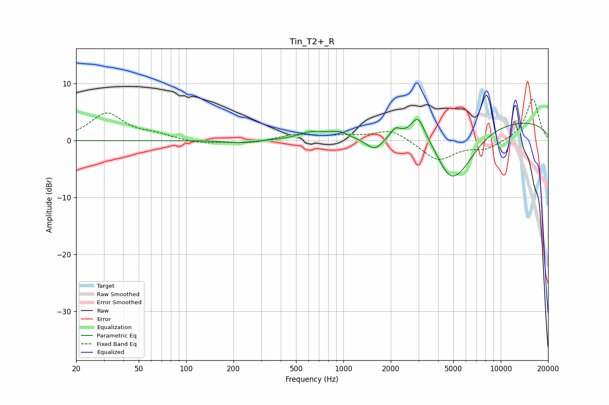

# Tin_T2+_R
See [usage instructions](https://github.com/jaakkopasanen/AutoEq#usage) for more options and info.

### Parametric EQs
Apply preamp of -3.8 dB when using parametric equalizer.

|   # | Type    |   Fc (Hz) |    Q |   Gain (dB) |
|-----|---------|-----------|------|-------------|
|   1 | Peaking |       222 | 1.57 |        -0.4 |
|   2 | Peaking |       641 | 1.63 |         1.4 |
|   3 | Peaking |       938 | 2.51 |         1   |
|   4 | Peaking |      1491 | 2.41 |        -0.7 |
|   5 | Peaking |      1601 | 3.04 |        -1.6 |
|   6 | Peaking |      2142 | 4.78 |         1.5 |
|   7 | Peaking |      2980 | 3.1  |         4.2 |
|   8 | Peaking |      4667 | 1.91 |        -3.9 |
|   9 | Peaking |      5500 | 1.14 |        -6.5 |
|  10 | Peaking |     10000 | 0.22 |         3.8 |

### Fixed Band EQs
When using fixed band (also called graphic) equalizer, apply preamp of **-7.4 dB** (if available) and set gains manually with these parameters.

|   # | Type    |   Fc (Hz) |    Q |   Gain (dB) |
|-----|---------|-----------|------|-------------|
|   1 | Peaking |        31 | 1.41 |         4.7 |
|   2 | Peaking |        62 | 1.41 |         0.9 |
|   3 | Peaking |       125 | 1.41 |        -0.6 |
|   4 | Peaking |       250 | 1.41 |        -0.5 |
|   5 | Peaking |       500 | 1.41 |         1.1 |
|   6 | Peaking |      1000 | 1.41 |         0.7 |
|   7 | Peaking |      2000 | 1.41 |         2   |
|   8 | Peaking |      4000 | 1.41 |        -3.5 |
|   9 | Peaking |      8000 | 1.41 |        -1.4 |
|  10 | Peaking |     16000 | 1.41 |         7.4 |

### Graphs

