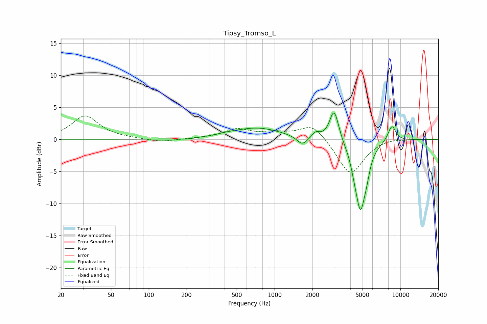

# Tipsy_Tromso_L
See [usage instructions](https://github.com/jaakkopasanen/AutoEq#usage) for more options and info.

### Parametric EQs
Apply preamp of -4.2 dB when using parametric equalizer.

|   # | Type    |   Fc (Hz) |    Q |   Gain (dB) |
|-----|---------|-----------|------|-------------|
|   1 | Peaking |       198 | 2.13 |        -0.2 |
|   2 | Peaking |       426 | 1.64 |         0.2 |
|   3 | Peaking |       732 | 0.74 |         1.7 |
|   4 | Peaking |      1656 | 3.4  |        -1.4 |
|   5 | Peaking |      2124 | 4.67 |         0.9 |
|   6 | Peaking |      2974 | 3.91 |         5   |
|   7 | Peaking |      4288 | 6    |        -0.9 |
|   8 | Peaking |      4810 | 3.26 |       -10.7 |
|   9 | Peaking |      5391 | 6    |        -1.4 |
|  10 | Peaking |      8557 | 4.06 |         2.5 |

### Fixed Band EQs
When using fixed band (also called graphic) equalizer, apply preamp of **-3.7 dB** (if available) and set gains manually with these parameters.

|   # | Type    |   Fc (Hz) |    Q |   Gain (dB) |
|-----|---------|-----------|------|-------------|
|   1 | Peaking |        31 | 1.41 |         3.6 |
|   2 | Peaking |        62 | 1.41 |         0.1 |
|   3 | Peaking |       125 | 1.41 |        -0.5 |
|   4 | Peaking |       250 | 1.41 |         0.1 |
|   5 | Peaking |       500 | 1.41 |         1.5 |
|   6 | Peaking |      1000 | 1.41 |         0.8 |
|   7 | Peaking |      2000 | 1.41 |         2.5 |
|   8 | Peaking |      4000 | 1.41 |        -5.6 |
|   9 | Peaking |      8000 | 1.41 |         0.3 |
|  10 | Peaking |     16000 | 1.41 |         0   |

### Graphs

