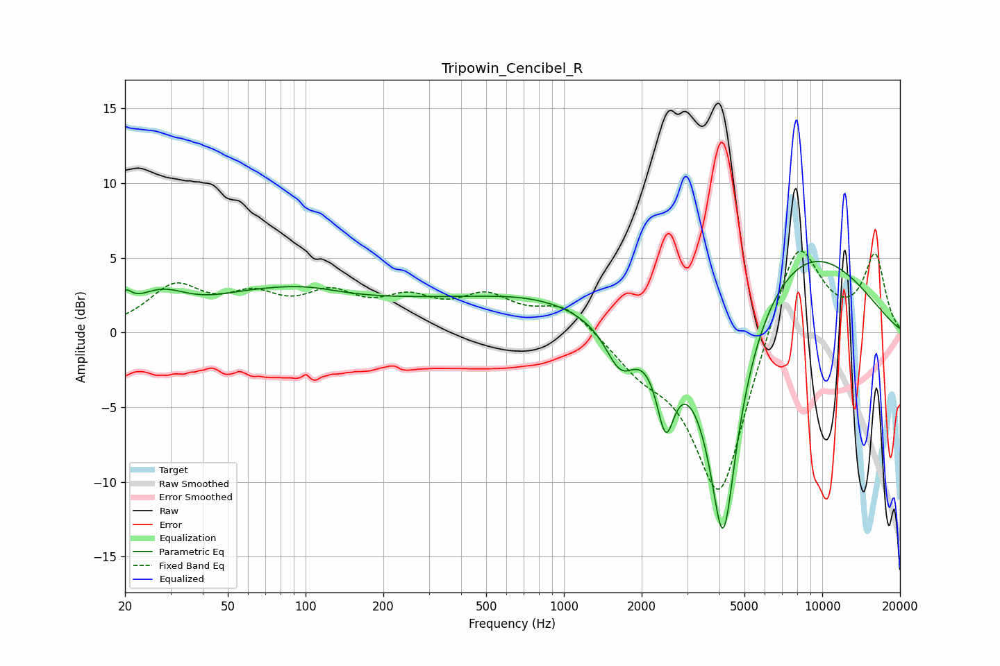

# Tripowin_Cencibel_R
See [usage instructions](https://github.com/jaakkopasanen/AutoEq#usage) for more options and info.

### Parametric EQs
Apply preamp of -4.8 dB when using parametric equalizer.

|   # | Type    |   Fc (Hz) |    Q |   Gain (dB) |
|-----|---------|-----------|------|-------------|
|   1 | Peaking |        20 | 5.57 |         1.2 |
|   2 | Peaking |        27 | 1.28 |         2.1 |
|   3 | Peaking |        59 | 0.78 |         1.4 |
|   4 | Peaking |        99 | 0.86 |         1.2 |
|   5 | Peaking |       253 | 0.43 |         1.6 |
|   6 | Peaking |       799 | 0.58 |         1.7 |
|   7 | Peaking |      1655 | 2.43 |        -2.9 |
|   8 | Peaking |      2477 | 4.03 |        -5.2 |
|   9 | Peaking |      4135 | 2.15 |       -16.7 |
|  10 | Peaking |      8097 | 0.46 |         6.1 |

### Fixed Band EQs
When using fixed band (also called graphic) equalizer, apply preamp of **-5.5 dB** (if available) and set gains manually with these parameters.

|   # | Type    |   Fc (Hz) |    Q |   Gain (dB) |
|-----|---------|-----------|------|-------------|
|   1 | Peaking |        31 | 1.41 |         2.8 |
|   2 | Peaking |        62 | 1.41 |         2   |
|   3 | Peaking |       125 | 1.41 |         2.1 |
|   4 | Peaking |       250 | 1.41 |         1.8 |
|   5 | Peaking |       500 | 1.41 |         2.1 |
|   6 | Peaking |      1000 | 1.41 |         1.9 |
|   7 | Peaking |      2000 | 1.41 |        -1.8 |
|   8 | Peaking |      4000 | 1.41 |       -11.4 |
|   9 | Peaking |      8000 | 1.41 |         7   |
|  10 | Peaking |     16000 | 1.41 |         5.1 |

### Graphs

