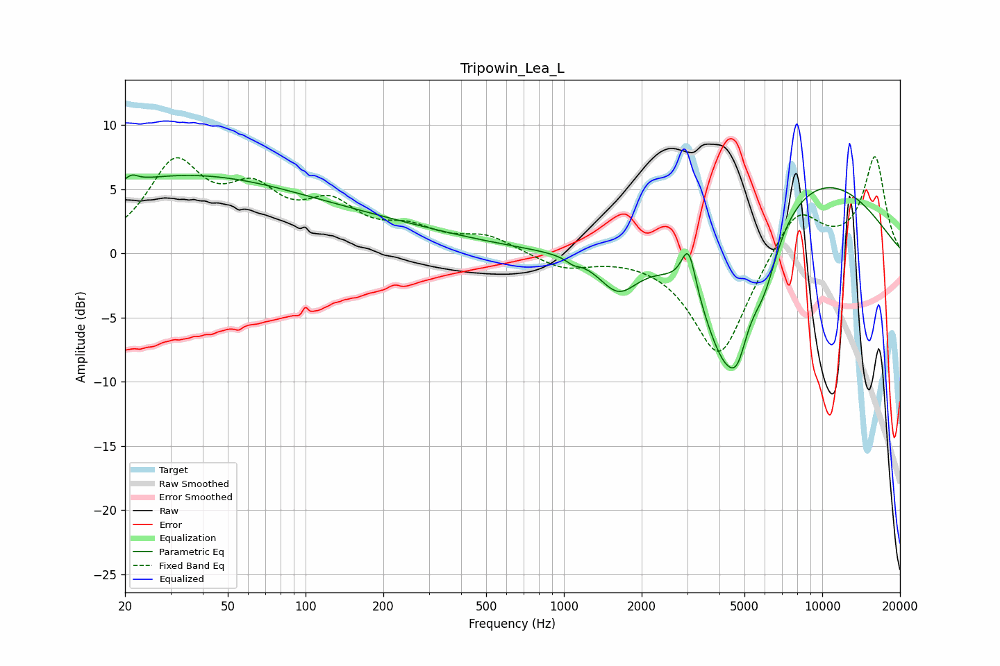

# Tripowin_Lea_L
See [usage instructions](https://github.com/jaakkopasanen/AutoEq#usage) for more options and info.

### Parametric EQs
Apply preamp of -6.2 dB when using parametric equalizer.

|   # | Type    |   Fc (Hz) |    Q |   Gain (dB) |
|-----|---------|-----------|------|-------------|
|   1 | Peaking |        21 | 5.94 |         0.5 |
|   2 | Peaking |        29 | 0.31 |         3.4 |
|   3 | Peaking |        64 | 0.18 |         2.8 |
|   4 | Peaking |      1084 | 5.61 |        -0.4 |
|   5 | Peaking |      1623 | 1.85 |        -2.9 |
|   6 | Peaking |      3040 | 4.94 |         3.7 |
|   7 | Peaking |      4243 | 1.26 |       -11.9 |
|   8 | Peaking |      4706 | 4.12 |        -2.2 |
|   9 | Peaking |      5972 | 2.63 |        -3.1 |
|  10 | Peaking |      8216 | 0.39 |         7   |

### Fixed Band EQs
When using fixed band (also called graphic) equalizer, apply preamp of **-7.6 dB** (if available) and set gains manually with these parameters.

|   # | Type    |   Fc (Hz) |    Q |   Gain (dB) |
|-----|---------|-----------|------|-------------|
|   1 | Peaking |        31 | 1.41 |         6.6 |
|   2 | Peaking |        62 | 1.41 |         3.9 |
|   3 | Peaking |       125 | 1.41 |         3.2 |
|   4 | Peaking |       250 | 1.41 |         1.6 |
|   5 | Peaking |       500 | 1.41 |         1.3 |
|   6 | Peaking |      1000 | 1.41 |        -1.1 |
|   7 | Peaking |      2000 | 1.41 |         0   |
|   8 | Peaking |      4000 | 1.41 |        -8.2 |
|   9 | Peaking |      8000 | 1.41 |         3.8 |
|  10 | Peaking |     16000 | 1.41 |         7.5 |

### Graphs

