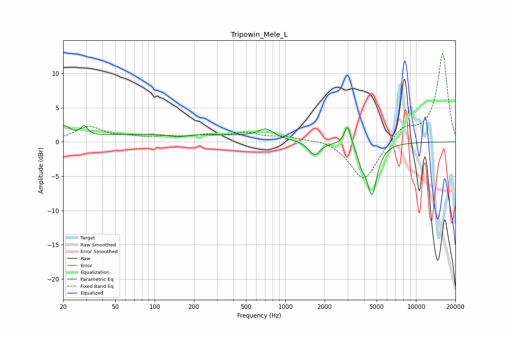

# Tripowin_Mele_L
See [usage instructions](https://github.com/jaakkopasanen/AutoEq#usage) for more options and info.

### Parametric EQs
Apply preamp of -2.5 dB when using parametric equalizer.

|   # | Type    |   Fc (Hz) |    Q |   Gain (dB) |
|-----|---------|-----------|------|-------------|
|   1 | Peaking |        20 | 2.85 |         1.8 |
|   2 | Peaking |        29 | 5.88 |         1.3 |
|   3 | Peaking |       124 | 0.18 |         1.2 |
|   4 | Peaking |       151 | 2.1  |        -0.4 |
|   5 | Peaking |       709 | 2.37 |         1.4 |
|   6 | Peaking |      1586 | 3.82 |        -0.1 |
|   7 | Peaking |      1677 | 3.28 |        -1.9 |
|   8 | Peaking |      2992 | 5.8  |         3   |
|   9 | Peaking |      3822 | 5.52 |        -1.7 |
|  10 | Peaking |      4592 | 3.53 |        -7.5 |

### Fixed Band EQs
When using fixed band (also called graphic) equalizer, apply preamp of **-13.0 dB** (if available) and set gains manually with these parameters.

|   # | Type    |   Fc (Hz) |    Q |   Gain (dB) |
|-----|---------|-----------|------|-------------|
|   1 | Peaking |        31 | 1.41 |         2.1 |
|   2 | Peaking |        62 | 1.41 |         0.6 |
|   3 | Peaking |       125 | 1.41 |         0.6 |
|   4 | Peaking |       250 | 1.41 |         0.8 |
|   5 | Peaking |       500 | 1.41 |         1.1 |
|   6 | Peaking |      1000 | 1.41 |         0.7 |
|   7 | Peaking |      2000 | 1.41 |         0.5 |
|   8 | Peaking |      4000 | 1.41 |        -5.8 |
|   9 | Peaking |      8000 | 1.41 |         2.1 |
|  10 | Peaking |     16000 | 1.41 |        12.9 |

### Graphs

