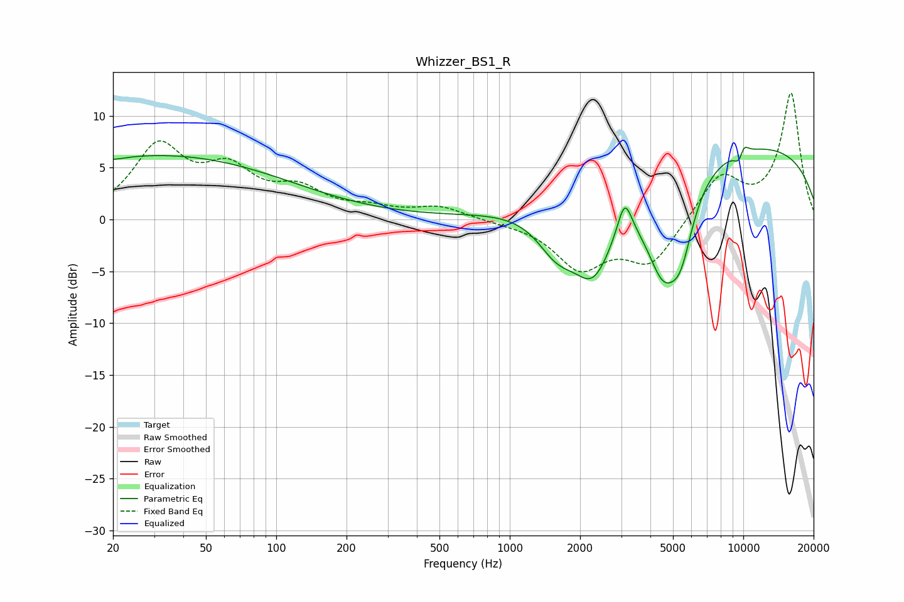

# Whizzer_BS1_R
See [usage instructions](https://github.com/jaakkopasanen/AutoEq#usage) for more options and info.

### Parametric EQs
Apply preamp of -7.1 dB when using parametric equalizer.

|   # | Type    |   Fc (Hz) |    Q |   Gain (dB) |
|-----|---------|-----------|------|-------------|
|   1 | Peaking |        21 | 4.46 |        -0.1 |
|   2 | Peaking |        31 | 0.24 |         6.2 |
|   3 | Peaking |      1589 | 1.62 |        -3.7 |
|   4 | Peaking |      2280 | 1.48 |        -7.8 |
|   5 | Peaking |      3104 | 4.68 |         3.4 |
|   6 | Peaking |      4540 | 1.71 |        -9.1 |
|   7 | Peaking |      5411 | 2.66 |        -5   |
|   8 | Peaking |      8578 | 0.18 |         7.6 |
|   9 | Peaking |      9626 | 5.9  |        -1.4 |
|  10 | Peaking |     10000 | 5.99 |         1.3 |

### Fixed Band EQs
When using fixed band (also called graphic) equalizer, apply preamp of **-12.3 dB** (if available) and set gains manually with these parameters.

|   # | Type    |   Fc (Hz) |    Q |   Gain (dB) |
|-----|---------|-----------|------|-------------|
|   1 | Peaking |        31 | 1.41 |         6.7 |
|   2 | Peaking |        62 | 1.41 |         4.1 |
|   3 | Peaking |       125 | 1.41 |         2.5 |
|   4 | Peaking |       250 | 1.41 |         0.8 |
|   5 | Peaking |       500 | 1.41 |         1.2 |
|   6 | Peaking |      1000 | 1.41 |        -0.2 |
|   7 | Peaking |      2000 | 1.41 |        -4.5 |
|   8 | Peaking |      4000 | 1.41 |        -4.2 |
|   9 | Peaking |      8000 | 1.41 |         4.2 |
|  10 | Peaking |     16000 | 1.41 |        12.1 |

### Graphs

