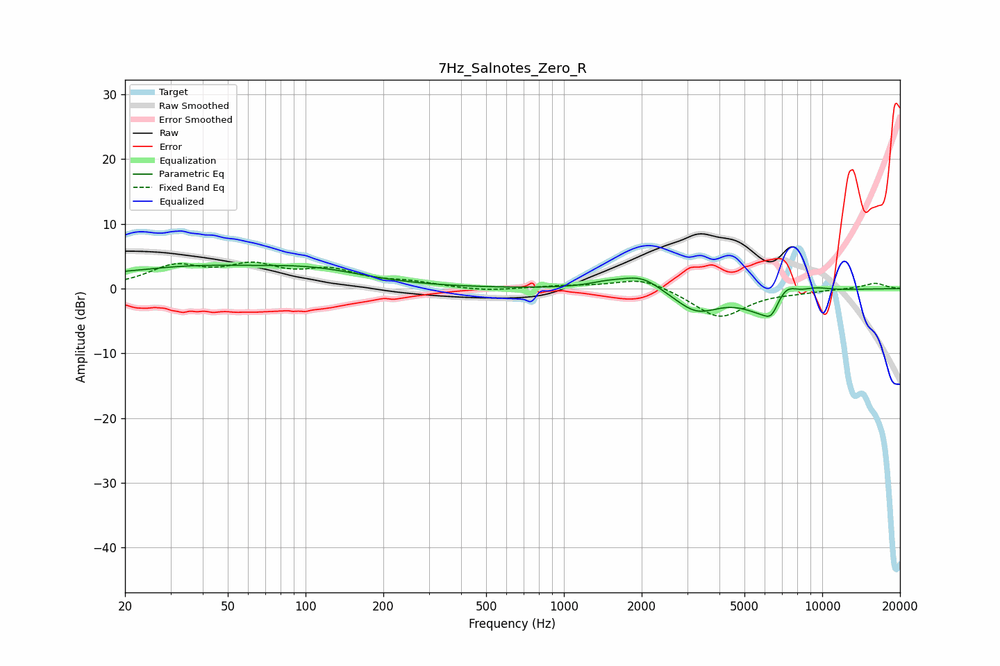

# 7Hz_Salnotes_Zero_R
See [usage instructions](https://github.com/jaakkopasanen/AutoEq#usage) for more options and info.

### Parametric EQs
Apply preamp of -3.7 dB when using parametric equalizer.

|   # | Type    |   Fc (Hz) |    Q |   Gain (dB) |
|-----|---------|-----------|------|-------------|
|   1 | Peaking |        21 | 0.88 |        -0.8 |
|   2 | Peaking |        28 | 0.38 |         3.5 |
|   3 | Peaking |       109 | 0.68 |         2.1 |
|   4 | Peaking |      1468 | 1.94 |         0.7 |
|   5 | Peaking |      2000 | 1.83 |         2.2 |
|   6 | Peaking |      3258 | 1.63 |        -3.4 |
|   7 | Peaking |      6184 | 1.53 |        -4.1 |
|   8 | Peaking |      6359 | 5.29 |        -1.6 |
|   9 | Peaking |      7190 | 2.87 |         3.2 |
|  10 | Peaking |      9371 | 2.13 |         0.7 |

### Fixed Band EQs
When using fixed band (also called graphic) equalizer, apply preamp of **-4.2 dB** (if available) and set gains manually with these parameters.

|   # | Type    |   Fc (Hz) |    Q |   Gain (dB) |
|-----|---------|-----------|------|-------------|
|   1 | Peaking |        31 | 1.41 |         3.2 |
|   2 | Peaking |        62 | 1.41 |         3   |
|   3 | Peaking |       125 | 1.41 |         2.4 |
|   4 | Peaking |       250 | 1.41 |         0.8 |
|   5 | Peaking |       500 | 1.41 |        -0.5 |
|   6 | Peaking |      1000 | 1.41 |         0.4 |
|   7 | Peaking |      2000 | 1.41 |         1.8 |
|   8 | Peaking |      4000 | 1.41 |        -4.5 |
|   9 | Peaking |      8000 | 1.41 |        -0.4 |
|  10 | Peaking |     16000 | 1.41 |         0.9 |

### Graphs

