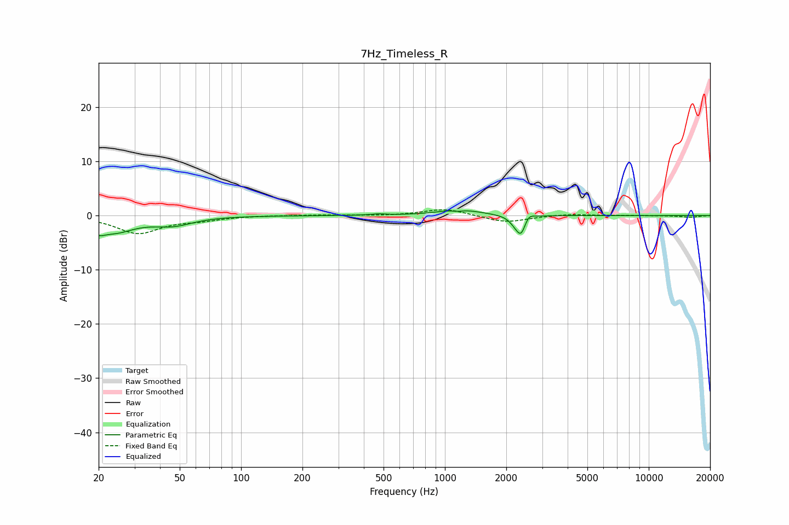

# 7Hz_Timeless_R
See [usage instructions](https://github.com/jaakkopasanen/AutoEq#usage) for more options and info.

### Parametric EQs
Apply preamp of -1.0 dB when using parametric equalizer.

|   # | Type    |   Fc (Hz) |    Q |   Gain (dB) |
|-----|---------|-----------|------|-------------|
|   1 | Peaking |        20 | 4.77 |        -1.3 |
|   2 | Peaking |        24 | 1.47 |        -2.7 |
|   3 | Peaking |        46 | 1.46 |        -1.5 |
|   4 | Peaking |       470 | 3.97 |         0.2 |
|   5 | Peaking |      1157 | 5.93 |        -0.3 |
|   6 | Peaking |      1179 | 1.39 |         1.1 |
|   7 | Peaking |      2211 | 5.05 |        -1   |
|   8 | Peaking |      2370 | 5.95 |        -3.5 |
|   9 | Peaking |      2556 | 6    |         1.4 |
|  10 | Peaking |      9971 | 4.96 |        -0   |

### Fixed Band EQs
When using fixed band (also called graphic) equalizer, apply preamp of **-1.2 dB** (if available) and set gains manually with these parameters.

|   # | Type    |   Fc (Hz) |    Q |   Gain (dB) |
|-----|---------|-----------|------|-------------|
|   1 | Peaking |        31 | 1.41 |        -3.2 |
|   2 | Peaking |        62 | 1.41 |        -0.7 |
|   3 | Peaking |       125 | 1.41 |         0   |
|   4 | Peaking |       250 | 1.41 |         0.1 |
|   5 | Peaking |       500 | 1.41 |        -0.1 |
|   6 | Peaking |      1000 | 1.41 |         1.3 |
|   7 | Peaking |      2000 | 1.41 |        -1.3 |
|   8 | Peaking |      4000 | 1.41 |         0.3 |
|   9 | Peaking |      8000 | 1.41 |         0   |
|  10 | Peaking |     16000 | 1.41 |        -0.3 |

### Graphs

