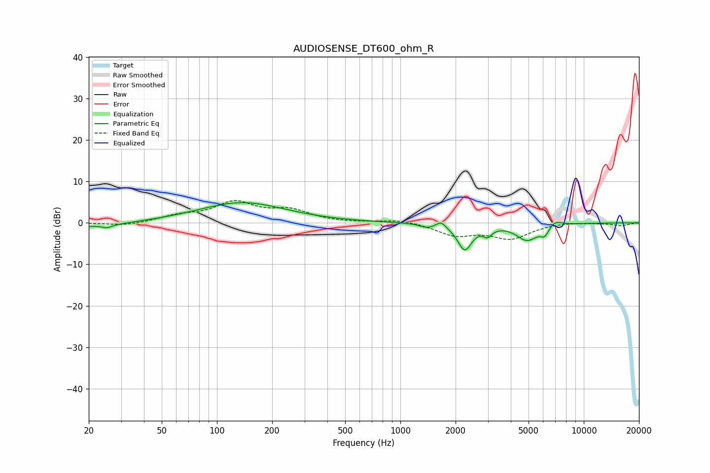

# AUDIOSENSE_DT600_ohm_R
See [usage instructions](https://github.com/jaakkopasanen/AutoEq#usage) for more options and info.

### Parametric EQs
Apply preamp of -5.0 dB when using parametric equalizer.

|   # | Type    |   Fc (Hz) |    Q |   Gain (dB) |
|-----|---------|-----------|------|-------------|
|   1 | Peaking |        20 | 0.72 |        -1.1 |
|   2 | Peaking |        25 | 5.42 |        -0.7 |
|   3 | Peaking |       137 | 0.6  |         4.9 |
|   4 | Peaking |      1397 | 3.63 |        -0.9 |
|   5 | Peaking |      1666 | 6    |         1.4 |
|   6 | Peaking |      2243 | 3.62 |        -6.2 |
|   7 | Peaking |      2990 | 6    |        -1.9 |
|   8 | Peaking |      4917 | 2.3  |        -4   |
|   9 | Peaking |      6137 | 6    |        -2.1 |
|  10 | Peaking |      6935 | 3.67 |         1.4 |

### Fixed Band EQs
When using fixed band (also called graphic) equalizer, apply preamp of **-5.5 dB** (if available) and set gains manually with these parameters.

|   # | Type    |   Fc (Hz) |    Q |   Gain (dB) |
|-----|---------|-----------|------|-------------|
|   1 | Peaking |        31 | 1.41 |        -0.8 |
|   2 | Peaking |        62 | 1.41 |         1.5 |
|   3 | Peaking |       125 | 1.41 |         4.6 |
|   4 | Peaking |       250 | 1.41 |         2.7 |
|   5 | Peaking |       500 | 1.41 |        -0   |
|   6 | Peaking |      1000 | 1.41 |         0.8 |
|   7 | Peaking |      2000 | 1.41 |        -2.8 |
|   8 | Peaking |      4000 | 1.41 |        -3.6 |
|   9 | Peaking |      8000 | 1.41 |         0.3 |
|  10 | Peaking |     16000 | 1.41 |        -0.7 |

### Graphs

