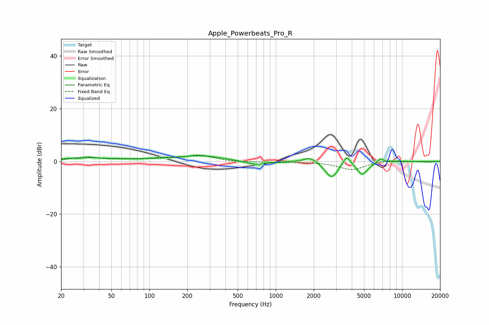

# Apple_Powerbeats_Pro_R
See [usage instructions](https://github.com/jaakkopasanen/AutoEq#usage) for more options and info.

### Parametric EQs
Apply preamp of -2.2 dB when using parametric equalizer.

|   # | Type    |   Fc (Hz) |    Q |   Gain (dB) |
|-----|---------|-----------|------|-------------|
|   1 | Peaking |        28 | 2.75 |        -0.8 |
|   2 | Peaking |        29 | 1.47 |         1.4 |
|   3 | Peaking |        78 | 0.22 |         0.7 |
|   4 | Peaking |       256 | 0.92 |         1.7 |
|   5 | Peaking |       695 | 1.77 |        -1.5 |
|   6 | Peaking |      1881 | 2.86 |         2   |
|   7 | Peaking |      2763 | 2.79 |        -6.2 |
|   8 | Peaking |      3647 | 4.71 |         3.8 |
|   9 | Peaking |      4846 | 3.28 |        -4.8 |
|  10 | Peaking |      6756 | 5.74 |         1.6 |

### Fixed Band EQs
When using fixed band (also called graphic) equalizer, apply preamp of **-2.5 dB** (if available) and set gains manually with these parameters.

|   # | Type    |   Fc (Hz) |    Q |   Gain (dB) |
|-----|---------|-----------|------|-------------|
|   1 | Peaking |        31 | 1.41 |         1.6 |
|   2 | Peaking |        62 | 1.41 |         0.4 |
|   3 | Peaking |       125 | 1.41 |         1   |
|   4 | Peaking |       250 | 1.41 |         2.2 |
|   5 | Peaking |       500 | 1.41 |        -0.3 |
|   6 | Peaking |      1000 | 1.41 |        -0.3 |
|   7 | Peaking |      2000 | 1.41 |        -0.2 |
|   8 | Peaking |      4000 | 1.41 |        -3.2 |
|   9 | Peaking |      8000 | 1.41 |         0.6 |
|  10 | Peaking |     16000 | 1.41 |        -0.3 |

### Graphs

