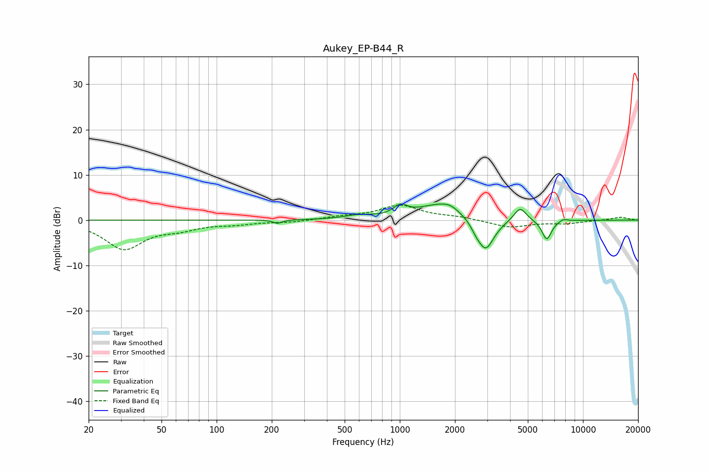

# Aukey_EP-B44_R
See [usage instructions](https://github.com/jaakkopasanen/AutoEq#usage) for more options and info.

### Parametric EQs
Apply preamp of -3.7 dB when using parametric equalizer.

|   # | Type    |   Fc (Hz) |    Q |   Gain (dB) |
|-----|---------|-----------|------|-------------|
|   1 | Peaking |       215 | 6    |        -0.8 |
|   2 | Peaking |       593 | 1.88 |         0.8 |
|   3 | Peaking |      1008 | 3.85 |         2.1 |
|   4 | Peaking |      1679 | 1.13 |         3.6 |
|   5 | Peaking |      1888 | 3.42 |         0.7 |
|   6 | Peaking |      2605 | 5.54 |        -1   |
|   7 | Peaking |      2940 | 2.95 |        -7.3 |
|   8 | Peaking |      4536 | 4.11 |         3.1 |
|   9 | Peaking |      6341 | 5.19 |        -4.4 |
|  10 | Peaking |      7806 | 6    |         0.6 |

### Fixed Band EQs
When using fixed band (also called graphic) equalizer, apply preamp of **-3.4 dB** (if available) and set gains manually with these parameters.

|   # | Type    |   Fc (Hz) |    Q |   Gain (dB) |
|-----|---------|-----------|------|-------------|
|   1 | Peaking |        31 | 1.41 |        -6.2 |
|   2 | Peaking |        62 | 1.41 |        -1.5 |
|   3 | Peaking |       125 | 1.41 |        -0.7 |
|   4 | Peaking |       250 | 1.41 |        -0.4 |
|   5 | Peaking |       500 | 1.41 |         0.7 |
|   6 | Peaking |      1000 | 1.41 |         3.2 |
|   7 | Peaking |      2000 | 1.41 |         0.6 |
|   8 | Peaking |      4000 | 1.41 |        -1.6 |
|   9 | Peaking |      8000 | 1.41 |        -0.7 |
|  10 | Peaking |     16000 | 1.41 |         0.7 |

### Graphs

