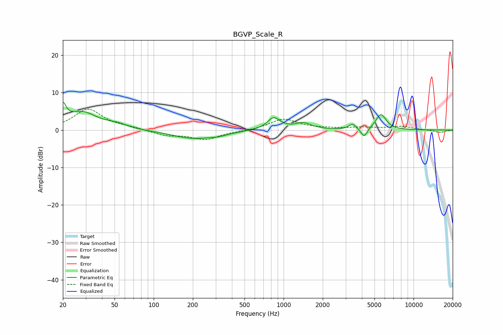

# BGVP_Scale_R
See [usage instructions](https://github.com/jaakkopasanen/AutoEq#usage) for more options and info.

### Parametric EQs
Apply preamp of -7.5 dB when using parametric equalizer.

|   # | Type    |   Fc (Hz) |    Q |   Gain (dB) |
|-----|---------|-----------|------|-------------|
|   1 | Peaking |        20 | 5.98 |         4.6 |
|   2 | Peaking |        28 | 1.2  |         4.7 |
|   3 | Peaking |        52 | 1.83 |         1   |
|   4 | Peaking |       199 | 0.85 |        -2.2 |
|   5 | Peaking |       314 | 1.86 |        -0.6 |
|   6 | Peaking |       839 | 2.84 |         3.2 |
|   7 | Peaking |      1410 | 2.27 |         1.7 |
|   8 | Peaking |      3397 | 5.04 |         1.5 |
|   9 | Peaking |      4161 | 5.78 |        -2.5 |
|  10 | Peaking |      5609 | 3.51 |         4.2 |

### Fixed Band EQs
When using fixed band (also called graphic) equalizer, apply preamp of **-5.7 dB** (if available) and set gains manually with these parameters.

|   # | Type    |   Fc (Hz) |    Q |   Gain (dB) |
|-----|---------|-----------|------|-------------|
|   1 | Peaking |        31 | 1.41 |         5.5 |
|   2 | Peaking |        62 | 1.41 |         0.6 |
|   3 | Peaking |       125 | 1.41 |        -1.4 |
|   4 | Peaking |       250 | 1.41 |        -2.4 |
|   5 | Peaking |       500 | 1.41 |        -0.2 |
|   6 | Peaking |      1000 | 1.41 |         2.9 |
|   7 | Peaking |      2000 | 1.41 |         0.3 |
|   8 | Peaking |      4000 | 1.41 |         0.6 |
|   9 | Peaking |      8000 | 1.41 |         0.9 |
|  10 | Peaking |     16000 | 1.41 |        -0.7 |

### Graphs

