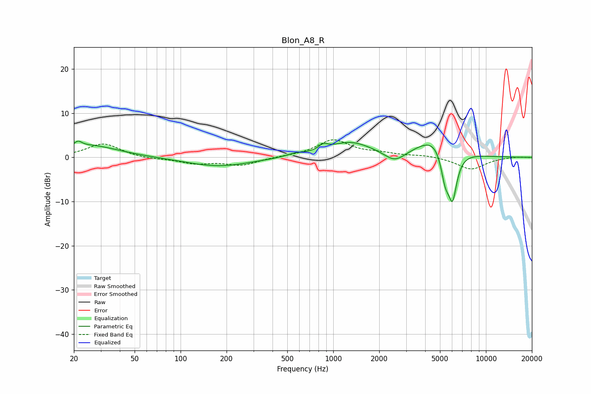

# Blon_A8_R
See [usage instructions](https://github.com/jaakkopasanen/AutoEq#usage) for more options and info.

### Parametric EQs
Apply preamp of -3.8 dB when using parametric equalizer.

|   # | Type    |   Fc (Hz) |    Q |   Gain (dB) |
|-----|---------|-----------|------|-------------|
|   1 | Peaking |        21 | 5.79 |         1.2 |
|   2 | Peaking |        25 | 0.75 |         2.7 |
|   3 | Peaking |       177 | 0.67 |        -2.1 |
|   4 | Peaking |       564 | 2.4  |         0.6 |
|   5 | Peaking |       860 | 4.85 |         1.2 |
|   6 | Peaking |      1290 | 0.98 |         3.4 |
|   7 | Peaking |      2532 | 2.07 |        -2.5 |
|   8 | Peaking |      4712 | 1.21 |         5   |
|   9 | Peaking |      5407 | 4.74 |        -6.4 |
|  10 | Peaking |      6042 | 4.46 |       -10.7 |

### Fixed Band EQs
When using fixed band (also called graphic) equalizer, apply preamp of **-4.1 dB** (if available) and set gains manually with these parameters.

|   # | Type    |   Fc (Hz) |    Q |   Gain (dB) |
|-----|---------|-----------|------|-------------|
|   1 | Peaking |        31 | 1.41 |         3.1 |
|   2 | Peaking |        62 | 1.41 |        -0.4 |
|   3 | Peaking |       125 | 1.41 |        -1.3 |
|   4 | Peaking |       250 | 1.41 |        -1.7 |
|   5 | Peaking |       500 | 1.41 |         0.1 |
|   6 | Peaking |      1000 | 1.41 |         3.9 |
|   7 | Peaking |      2000 | 1.41 |         0.7 |
|   8 | Peaking |      4000 | 1.41 |         0.5 |
|   9 | Peaking |      8000 | 1.41 |        -2.7 |
|  10 | Peaking |     16000 | 1.41 |         0.2 |

### Graphs

