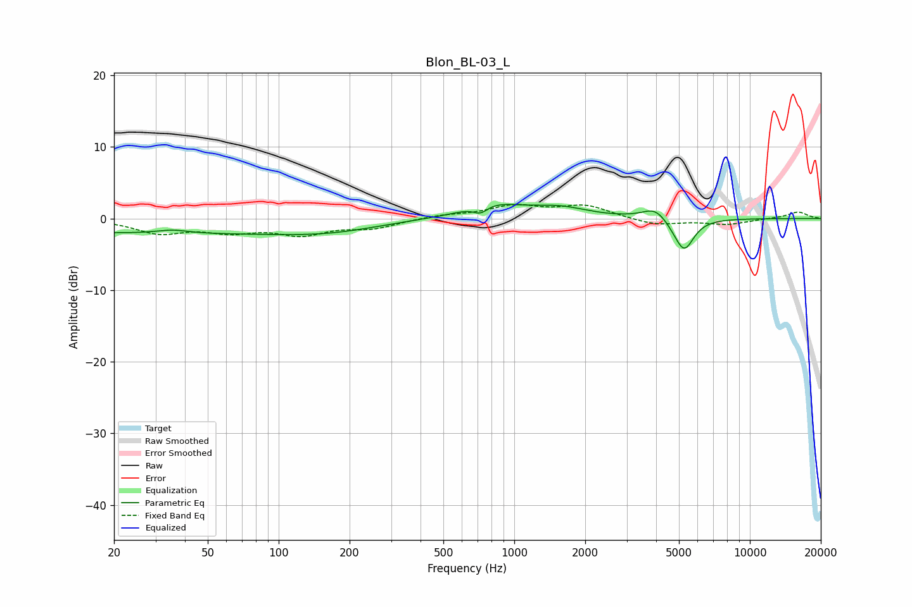

# Blon_BL-03_L
See [usage instructions](https://github.com/jaakkopasanen/AutoEq#usage) for more options and info.

### Parametric EQs
Apply preamp of -2.1 dB when using parametric equalizer.

|   # | Type    |   Fc (Hz) |    Q |   Gain (dB) |
|-----|---------|-----------|------|-------------|
|   1 | Peaking |        29 | 0.19 |        -2   |
|   2 | Peaking |        35 | 2.12 |         0.5 |
|   3 | Peaking |       165 | 0.64 |        -1.2 |
|   4 | Peaking |       576 | 1.44 |        -0.3 |
|   5 | Peaking |       719 | 4.45 |        -1.2 |
|   6 | Peaking |       775 | 1.05 |         2.2 |
|   7 | Peaking |      1561 | 1.21 |         1.3 |
|   8 | Peaking |      3970 | 2.66 |         1.7 |
|   9 | Peaking |      4931 | 2.88 |        -0.9 |
|  10 | Peaking |      5285 | 3.49 |        -3.9 |

### Fixed Band EQs
When using fixed band (also called graphic) equalizer, apply preamp of **-2.1 dB** (if available) and set gains manually with these parameters.

|   # | Type    |   Fc (Hz) |    Q |   Gain (dB) |
|-----|---------|-----------|------|-------------|
|   1 | Peaking |        31 | 1.41 |        -1.9 |
|   2 | Peaking |        62 | 1.41 |        -1.5 |
|   3 | Peaking |       125 | 1.41 |        -2   |
|   4 | Peaking |       250 | 1.41 |        -1.2 |
|   5 | Peaking |       500 | 1.41 |         0.4 |
|   6 | Peaking |      1000 | 1.41 |         1.7 |
|   7 | Peaking |      2000 | 1.41 |         1.7 |
|   8 | Peaking |      4000 | 1.41 |        -0.9 |
|   9 | Peaking |      8000 | 1.41 |        -0.8 |
|  10 | Peaking |     16000 | 1.41 |         0.9 |

### Graphs

