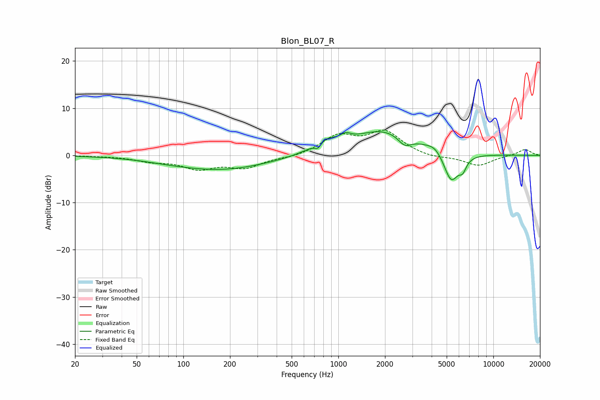

# Blon_BL07_R
See [usage instructions](https://github.com/jaakkopasanen/AutoEq#usage) for more options and info.

### Parametric EQs
Apply preamp of -5.1 dB when using parametric equalizer.

|   # | Type    |   Fc (Hz) |    Q |   Gain (dB) |
|-----|---------|-----------|------|-------------|
|   1 | Peaking |        78 | 1.09 |        -0.1 |
|   2 | Peaking |       172 | 0.45 |        -3.1 |
|   3 | Peaking |       738 | 6    |        -1.5 |
|   4 | Peaking |       807 | 1.89 |         2.4 |
|   5 | Peaking |      1114 | 4.29 |         1.2 |
|   6 | Peaking |      1963 | 0.67 |         5.3 |
|   7 | Peaking |      2678 | 3.25 |        -2.1 |
|   8 | Peaking |      4216 | 2.75 |         1.4 |
|   9 | Peaking |      5343 | 2.8  |        -6.5 |
|  10 | Peaking |      6348 | 5.98 |        -2.1 |

### Fixed Band EQs
When using fixed band (also called graphic) equalizer, apply preamp of **-5.4 dB** (if available) and set gains manually with these parameters.

|   # | Type    |   Fc (Hz) |    Q |   Gain (dB) |
|-----|---------|-----------|------|-------------|
|   1 | Peaking |        31 | 1.41 |        -0.1 |
|   2 | Peaking |        62 | 1.41 |        -1.1 |
|   3 | Peaking |       125 | 1.41 |        -2.6 |
|   4 | Peaking |       250 | 1.41 |        -2.4 |
|   5 | Peaking |       500 | 1.41 |        -0.4 |
|   6 | Peaking |      1000 | 1.41 |         3.9 |
|   7 | Peaking |      2000 | 1.41 |         4.8 |
|   8 | Peaking |      4000 | 1.41 |        -0.6 |
|   9 | Peaking |      8000 | 1.41 |        -2.2 |
|  10 | Peaking |     16000 | 1.41 |         1.3 |

### Graphs

