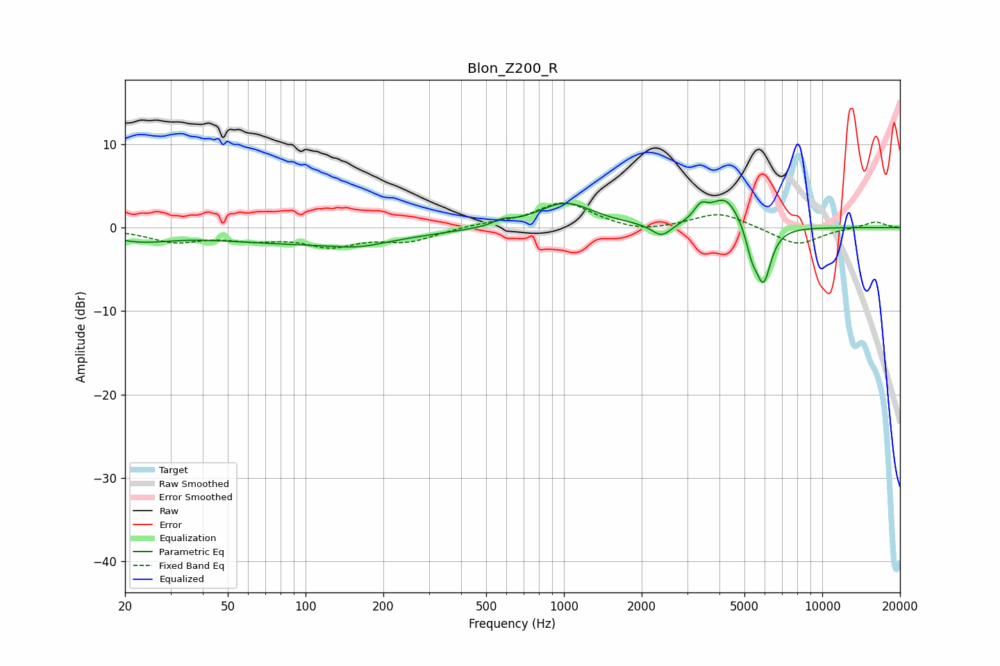

# Blon_Z200_R
See [usage instructions](https://github.com/jaakkopasanen/AutoEq#usage) for more options and info.

### Parametric EQs
Apply preamp of -3.4 dB when using parametric equalizer.

|   # | Type    |   Fc (Hz) |    Q |   Gain (dB) |
|-----|---------|-----------|------|-------------|
|   1 | Peaking |        23 | 1.18 |        -1.2 |
|   2 | Peaking |       103 | 0.38 |        -1.8 |
|   3 | Peaking |       161 | 1.44 |        -0.7 |
|   4 | Peaking |       580 | 4.12 |         0.6 |
|   5 | Peaking |      1012 | 1.31 |         3   |
|   6 | Peaking |      2389 | 3.67 |        -1.6 |
|   7 | Peaking |      3385 | 5.39 |         1.6 |
|   8 | Peaking |      4226 | 2.33 |         3.7 |
|   9 | Peaking |      5340 | 5.95 |        -2.6 |
|  10 | Peaking |      5921 | 4.57 |        -6.6 |

### Fixed Band EQs
When using fixed band (also called graphic) equalizer, apply preamp of **-3.1 dB** (if available) and set gains manually with these parameters.

|   # | Type    |   Fc (Hz) |    Q |   Gain (dB) |
|-----|---------|-----------|------|-------------|
|   1 | Peaking |        31 | 1.41 |        -1.6 |
|   2 | Peaking |        62 | 1.41 |        -1.1 |
|   3 | Peaking |       125 | 1.41 |        -2   |
|   4 | Peaking |       250 | 1.41 |        -1.5 |
|   5 | Peaking |       500 | 1.41 |         0.4 |
|   6 | Peaking |      1000 | 1.41 |         3   |
|   7 | Peaking |      2000 | 1.41 |        -0.7 |
|   8 | Peaking |      4000 | 1.41 |         1.9 |
|   9 | Peaking |      8000 | 1.41 |        -2.1 |
|  10 | Peaking |     16000 | 1.41 |         0.7 |

### Graphs

