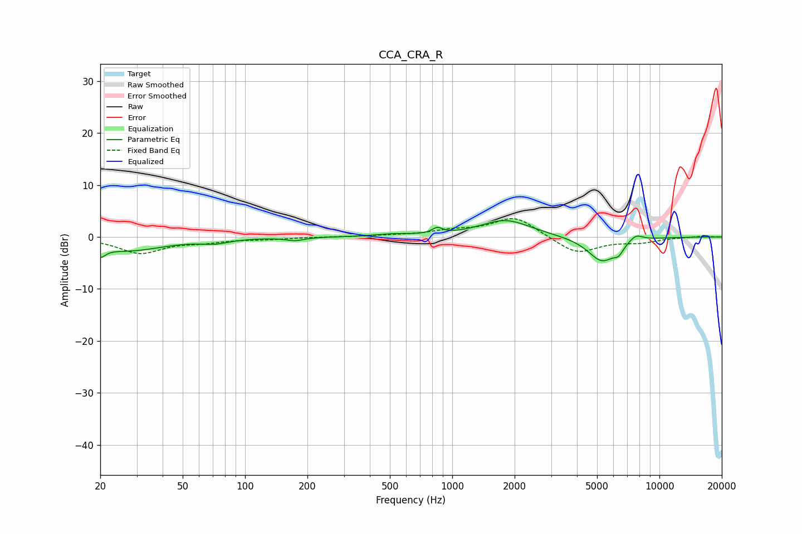

# CCA_CRA_R
See [usage instructions](https://github.com/jaakkopasanen/AutoEq#usage) for more options and info.

### Parametric EQs
Apply preamp of -3.2 dB when using parametric equalizer.

|   # | Type    |   Fc (Hz) |    Q |   Gain (dB) |
|-----|---------|-----------|------|-------------|
|   1 | Peaking |        20 | 5.88 |        -1.8 |
|   2 | Peaking |        27 | 0.78 |        -2.6 |
|   3 | Peaking |        72 | 2.16 |        -0.8 |
|   4 | Peaking |       174 | 3.34 |        -0.6 |
|   5 | Peaking |       520 | 1.71 |         0.4 |
|   6 | Peaking |       847 | 5.92 |         1.1 |
|   7 | Peaking |      1809 | 1.16 |         3.3 |
|   8 | Peaking |      5288 | 2    |        -4.8 |
|   9 | Peaking |      6356 | 6    |        -1.4 |
|  10 | Peaking |      7699 | 3.96 |         1.3 |

### Fixed Band EQs
When using fixed band (also called graphic) equalizer, apply preamp of **-3.6 dB** (if available) and set gains manually with these parameters.

|   # | Type    |   Fc (Hz) |    Q |   Gain (dB) |
|-----|---------|-----------|------|-------------|
|   1 | Peaking |        31 | 1.41 |        -3   |
|   2 | Peaking |        62 | 1.41 |        -0.8 |
|   3 | Peaking |       125 | 1.41 |        -0.4 |
|   4 | Peaking |       250 | 1.41 |         0   |
|   5 | Peaking |       500 | 1.41 |         0.2 |
|   6 | Peaking |      1000 | 1.41 |         1   |
|   7 | Peaking |      2000 | 1.41 |         3.9 |
|   8 | Peaking |      4000 | 1.41 |        -3.3 |
|   9 | Peaking |      8000 | 1.41 |        -0.9 |
|  10 | Peaking |     16000 | 1.41 |         0.2 |

### Graphs

