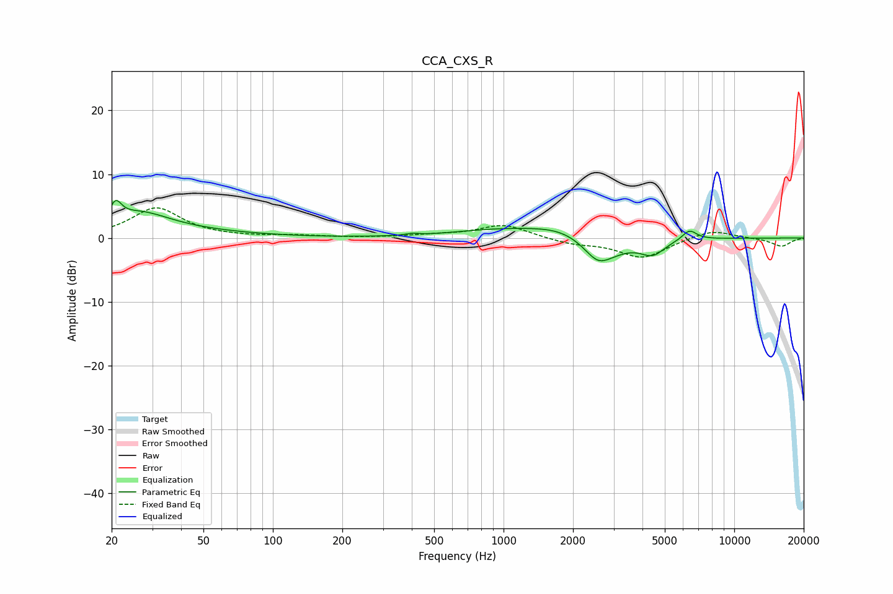

# CCA_CXS_R
See [usage instructions](https://github.com/jaakkopasanen/AutoEq#usage) for more options and info.

### Parametric EQs
Apply preamp of -6.0 dB when using parametric equalizer.

|   # | Type    |   Fc (Hz) |    Q |   Gain (dB) |
|-----|---------|-----------|------|-------------|
|   1 | Peaking |        21 | 5.83 |         2.7 |
|   2 | Peaking |        26 | 1.12 |         2.8 |
|   3 | Peaking |        31 | 0.43 |         1.1 |
|   4 | Peaking |       402 | 5.43 |         0.3 |
|   5 | Peaking |       911 | 0.74 |         1   |
|   6 | Peaking |      1927 | 0.9  |         2.3 |
|   7 | Peaking |      2554 | 2.84 |        -1.6 |
|   8 | Peaking |      2654 | 1.32 |        -3.7 |
|   9 | Peaking |      4427 | 2.68 |        -2.2 |
|  10 | Peaking |      6392 | 4.35 |         1.6 |

### Fixed Band EQs
When using fixed band (also called graphic) equalizer, apply preamp of **-4.8 dB** (if available) and set gains manually with these parameters.

|   # | Type    |   Fc (Hz) |    Q |   Gain (dB) |
|-----|---------|-----------|------|-------------|
|   1 | Peaking |        31 | 1.41 |         4.7 |
|   2 | Peaking |        62 | 1.41 |         0.1 |
|   3 | Peaking |       125 | 1.41 |         0.3 |
|   4 | Peaking |       250 | 1.41 |         0   |
|   5 | Peaking |       500 | 1.41 |         0.4 |
|   6 | Peaking |      1000 | 1.41 |         2.1 |
|   7 | Peaking |      2000 | 1.41 |        -0.8 |
|   8 | Peaking |      4000 | 1.41 |        -3.1 |
|   9 | Peaking |      8000 | 1.41 |         1.4 |
|  10 | Peaking |     16000 | 1.41 |        -1.3 |

### Graphs

