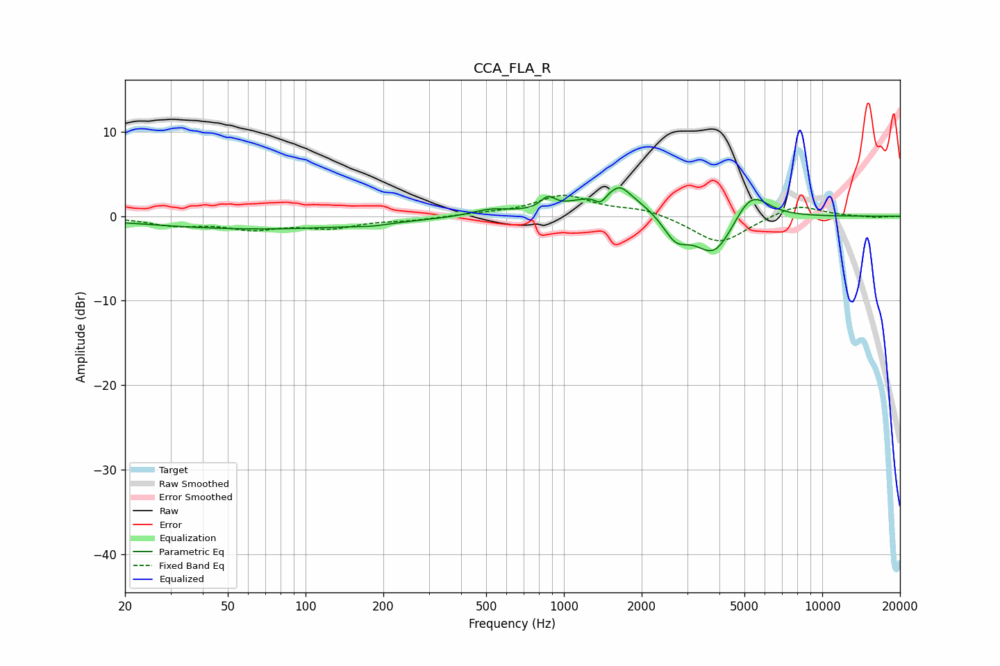

# CCA_FLA_R
See [usage instructions](https://github.com/jaakkopasanen/AutoEq#usage) for more options and info.

### Parametric EQs
Apply preamp of -3.5 dB when using parametric equalizer.

|   # | Type    |   Fc (Hz) |    Q |   Gain (dB) |
|-----|---------|-----------|------|-------------|
|   1 | Peaking |        67 | 0.31 |        -1.5 |
|   2 | Peaking |       180 | 2.29 |        -0.3 |
|   3 | Peaking |       518 | 1.92 |         0.7 |
|   4 | Peaking |       867 | 5.31 |         1.3 |
|   5 | Peaking |      1386 | 5.85 |        -1.3 |
|   6 | Peaking |      1555 | 1.14 |         3.3 |
|   7 | Peaking |      1651 | 4.44 |         0.9 |
|   8 | Peaking |      2710 | 2.85 |        -2.8 |
|   9 | Peaking |      3823 | 1.81 |        -5.1 |
|  10 | Peaking |      5287 | 2.04 |         3.7 |

### Fixed Band EQs
When using fixed band (also called graphic) equalizer, apply preamp of **-2.6 dB** (if available) and set gains manually with these parameters.

|   # | Type    |   Fc (Hz) |    Q |   Gain (dB) |
|-----|---------|-----------|------|-------------|
|   1 | Peaking |        31 | 1.41 |        -1   |
|   2 | Peaking |        62 | 1.41 |        -1.3 |
|   3 | Peaking |       125 | 1.41 |        -1.2 |
|   4 | Peaking |       250 | 1.41 |        -0.4 |
|   5 | Peaking |       500 | 1.41 |         0.2 |
|   6 | Peaking |      1000 | 1.41 |         2.4 |
|   7 | Peaking |      2000 | 1.41 |         0.8 |
|   8 | Peaking |      4000 | 1.41 |        -3.3 |
|   9 | Peaking |      8000 | 1.41 |         1.5 |
|  10 | Peaking |     16000 | 1.41 |        -0.2 |

### Graphs

