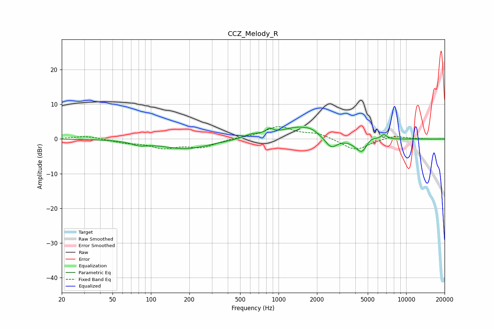

# CCZ_Melody_R
See [usage instructions](https://github.com/jaakkopasanen/AutoEq#usage) for more options and info.

### Parametric EQs
Apply preamp of -3.5 dB when using parametric equalizer.

|   # | Type    |   Fc (Hz) |    Q |   Gain (dB) |
|-----|---------|-----------|------|-------------|
|   1 | Peaking |        81 | 2.31 |        -1.1 |
|   2 | Peaking |       186 | 0.74 |        -2.8 |
|   3 | Peaking |       619 | 2.16 |         1.2 |
|   4 | Peaking |       851 | 4.85 |         1.5 |
|   5 | Peaking |      1419 | 1.04 |         3.3 |
|   6 | Peaking |      1809 | 2.75 |         0.9 |
|   7 | Peaking |      2583 | 3    |        -3.2 |
|   8 | Peaking |      4555 | 2.6  |        -5.4 |
|   9 | Peaking |      5112 | 2.72 |         2.6 |
|  10 | Peaking |      6684 | 6    |         1.4 |

### Fixed Band EQs
When using fixed band (also called graphic) equalizer, apply preamp of **-3.7 dB** (if available) and set gains manually with these parameters.

|   # | Type    |   Fc (Hz) |    Q |   Gain (dB) |
|-----|---------|-----------|------|-------------|
|   1 | Peaking |        31 | 1.41 |         0.9 |
|   2 | Peaking |        62 | 1.41 |        -0.9 |
|   3 | Peaking |       125 | 1.41 |        -2.4 |
|   4 | Peaking |       250 | 1.41 |        -2.3 |
|   5 | Peaking |       500 | 1.41 |         0.3 |
|   6 | Peaking |      1000 | 1.41 |         3.4 |
|   7 | Peaking |      2000 | 1.41 |         1.5 |
|   8 | Peaking |      4000 | 1.41 |        -3.4 |
|   9 | Peaking |      8000 | 1.41 |         1   |
|  10 | Peaking |     16000 | 1.41 |        -0.1 |

### Graphs

