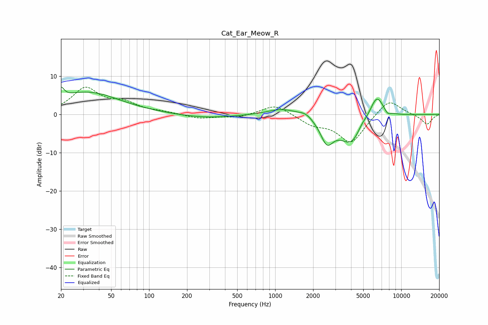

# Cat_Ear_Meow_R
See [usage instructions](https://github.com/jaakkopasanen/AutoEq#usage) for more options and info.

### Parametric EQs
Apply preamp of -7.2 dB when using parametric equalizer.

|   # | Type    |   Fc (Hz) |    Q |   Gain (dB) |
|-----|---------|-----------|------|-------------|
|   1 | Peaking |        20 | 5.98 |         2.7 |
|   2 | Peaking |        32 | 0.55 |         5.8 |
|   3 | Peaking |       285 | 0.64 |        -1   |
|   4 | Peaking |      1144 | 1.22 |         1.8 |
|   5 | Peaking |      1747 | 2.63 |         1.2 |
|   6 | Peaking |      2573 | 2.71 |        -5.9 |
|   7 | Peaking |      4068 | 1.38 |        -7.9 |
|   8 | Peaking |      4852 | 3.17 |         1.6 |
|   9 | Peaking |      6383 | 2.37 |         6.6 |
|  10 | Peaking |      7771 | 5.17 |        -1.1 |

### Fixed Band EQs
When using fixed band (also called graphic) equalizer, apply preamp of **-7.2 dB** (if available) and set gains manually with these parameters.

|   # | Type    |   Fc (Hz) |    Q |   Gain (dB) |
|-----|---------|-----------|------|-------------|
|   1 | Peaking |        31 | 1.41 |         6.6 |
|   2 | Peaking |        62 | 1.41 |         2.6 |
|   3 | Peaking |       125 | 1.41 |         0.5 |
|   4 | Peaking |       250 | 1.41 |        -1.1 |
|   5 | Peaking |       500 | 1.41 |        -0.8 |
|   6 | Peaking |      1000 | 1.41 |         2.7 |
|   7 | Peaking |      2000 | 1.41 |        -2.3 |
|   8 | Peaking |      4000 | 1.41 |        -7.4 |
|   9 | Peaking |      8000 | 1.41 |         4.3 |
|  10 | Peaking |     16000 | 1.41 |        -2.6 |

### Graphs

