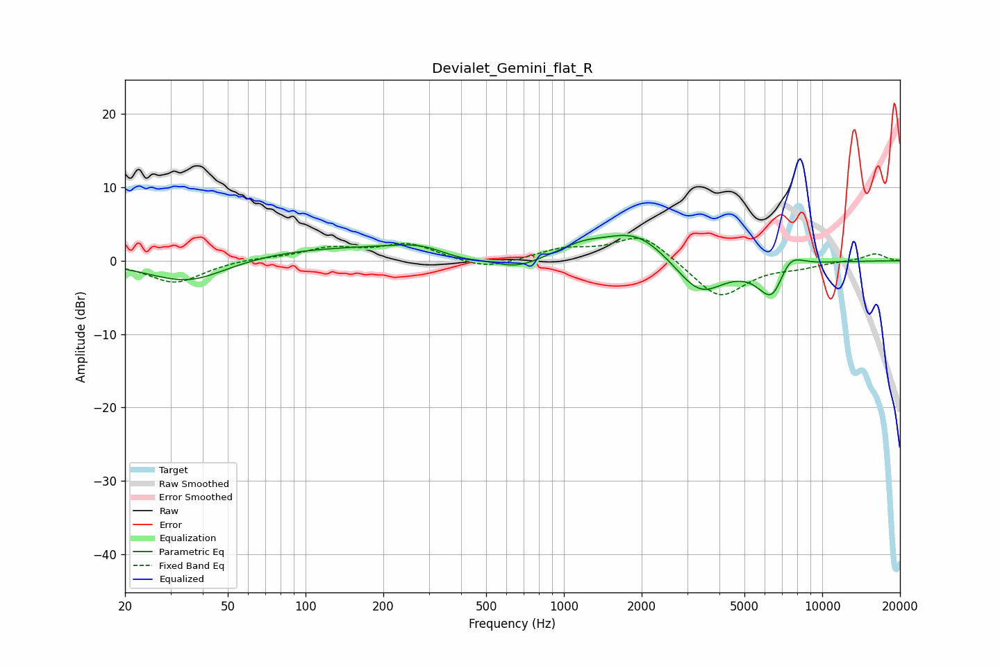

# Devialet_Gemini_flat_R
See [usage instructions](https://github.com/jaakkopasanen/AutoEq#usage) for more options and info.

### Parametric EQs
Apply preamp of -3.6 dB when using parametric equalizer.

|   # | Type    |   Fc (Hz) |    Q |   Gain (dB) |
|-----|---------|-----------|------|-------------|
|   1 | Peaking |        35 | 0.89 |        -3.6 |
|   2 | Peaking |       149 | 0.23 |         2   |
|   3 | Peaking |       281 | 1.34 |         1   |
|   4 | Peaking |       396 | 1.4  |        -1.2 |
|   5 | Peaking |       656 | 1.45 |        -2   |
|   6 | Peaking |      1179 | 1.58 |         1.3 |
|   7 | Peaking |      1911 | 1.12 |         4   |
|   8 | Peaking |      3356 | 1.47 |        -5   |
|   9 | Peaking |      6424 | 2.43 |        -5.7 |
|  10 | Peaking |      7397 | 2.56 |         3.2 |

### Fixed Band EQs
When using fixed band (also called graphic) equalizer, apply preamp of **-3.2 dB** (if available) and set gains manually with these parameters.

|   # | Type    |   Fc (Hz) |    Q |   Gain (dB) |
|-----|---------|-----------|------|-------------|
|   1 | Peaking |        31 | 1.41 |        -3   |
|   2 | Peaking |        62 | 1.41 |         0.4 |
|   3 | Peaking |       125 | 1.41 |         1.6 |
|   4 | Peaking |       250 | 1.41 |         2.2 |
|   5 | Peaking |       500 | 1.41 |        -1.3 |
|   6 | Peaking |      1000 | 1.41 |         1.5 |
|   7 | Peaking |      2000 | 1.41 |         3.7 |
|   8 | Peaking |      4000 | 1.41 |        -5.2 |
|   9 | Peaking |      8000 | 1.41 |        -0.7 |
|  10 | Peaking |     16000 | 1.41 |         1   |

### Graphs

