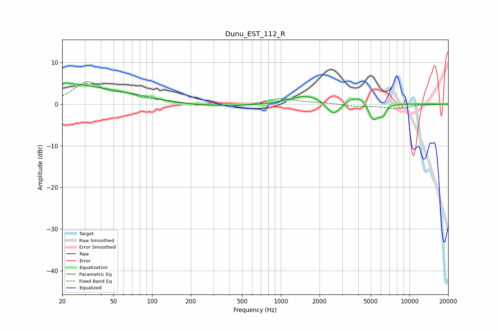

# Dunu_EST_112_R
See [usage instructions](https://github.com/jaakkopasanen/AutoEq#usage) for more options and info.

### Parametric EQs
Apply preamp of -5.2 dB when using parametric equalizer.

|   # | Type    |   Fc (Hz) |    Q |   Gain (dB) |
|-----|---------|-----------|------|-------------|
|   1 | Peaking |        20 | 0.33 |         4.9 |
|   2 | Peaking |        20 | 5.92 |        -2.8 |
|   3 | Peaking |        20 | 5.85 |         2.6 |
|   4 | Peaking |        85 | 0.84 |         0.7 |
|   5 | Peaking |       227 | 0.21 |        -0.6 |
|   6 | Peaking |      1597 | 1.08 |         2.3 |
|   7 | Peaking |      2569 | 2.55 |        -3.6 |
|   8 | Peaking |      3979 | 1.55 |         2.3 |
|   9 | Peaking |      5211 | 3.79 |        -4.5 |
|  10 | Peaking |      6161 | 5.77 |        -2.4 |

### Fixed Band EQs
When using fixed band (also called graphic) equalizer, apply preamp of **-5.5 dB** (if available) and set gains manually with these parameters.

|   # | Type    |   Fc (Hz) |    Q |   Gain (dB) |
|-----|---------|-----------|------|-------------|
|   1 | Peaking |        31 | 1.41 |         5.1 |
|   2 | Peaking |        62 | 1.41 |         1.7 |
|   3 | Peaking |       125 | 1.41 |         0.6 |
|   4 | Peaking |       250 | 1.41 |        -0.4 |
|   5 | Peaking |       500 | 1.41 |        -0.5 |
|   6 | Peaking |      1000 | 1.41 |         1.4 |
|   7 | Peaking |      2000 | 1.41 |         0.3 |
|   8 | Peaking |      4000 | 1.41 |        -0.5 |
|   9 | Peaking |      8000 | 1.41 |        -1.1 |
|  10 | Peaking |     16000 | 1.41 |        -0.1 |

### Graphs

