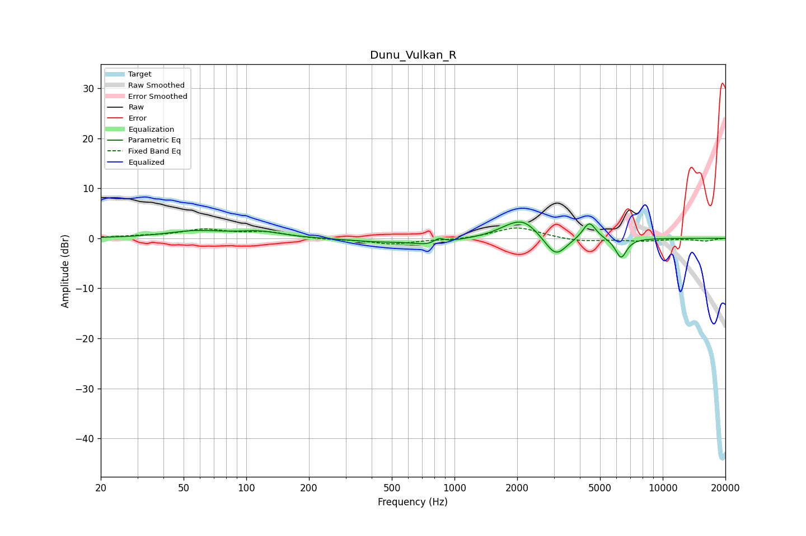

# Dunu_Vulkan_R
See [usage instructions](https://github.com/jaakkopasanen/AutoEq#usage) for more options and info.

### Parametric EQs
Apply preamp of -3.4 dB when using parametric equalizer.

|   # | Type    |   Fc (Hz) |    Q |   Gain (dB) |
|-----|---------|-----------|------|-------------|
|   1 | Peaking |        57 | 1.01 |         1.4 |
|   2 | Peaking |       116 | 1.37 |         1.1 |
|   3 | Peaking |       419 | 1.01 |        -0.6 |
|   4 | Peaking |       782 | 1.72 |        -1.3 |
|   5 | Peaking |       842 | 5.56 |         1.1 |
|   6 | Peaking |      1817 | 1.89 |         1.1 |
|   7 | Peaking |      2153 | 1.99 |         3.2 |
|   8 | Peaking |      3065 | 2.74 |        -4.1 |
|   9 | Peaking |      4440 | 4.37 |         3.5 |
|  10 | Peaking |      6310 | 5.03 |        -4   |

### Fixed Band EQs
When using fixed band (also called graphic) equalizer, apply preamp of **-2.2 dB** (if available) and set gains manually with these parameters.

|   # | Type    |   Fc (Hz) |    Q |   Gain (dB) |
|-----|---------|-----------|------|-------------|
|   1 | Peaking |        31 | 1.41 |         0.4 |
|   2 | Peaking |        62 | 1.41 |         1.6 |
|   3 | Peaking |       125 | 1.41 |         1.1 |
|   4 | Peaking |       250 | 1.41 |        -0.2 |
|   5 | Peaking |       500 | 1.41 |        -1.1 |
|   6 | Peaking |      1000 | 1.41 |        -0.3 |
|   7 | Peaking |      2000 | 1.41 |         2.3 |
|   8 | Peaking |      4000 | 1.41 |        -0.7 |
|   9 | Peaking |      8000 | 1.41 |        -0.5 |
|  10 | Peaking |     16000 | 1.41 |        -0.5 |

### Graphs

