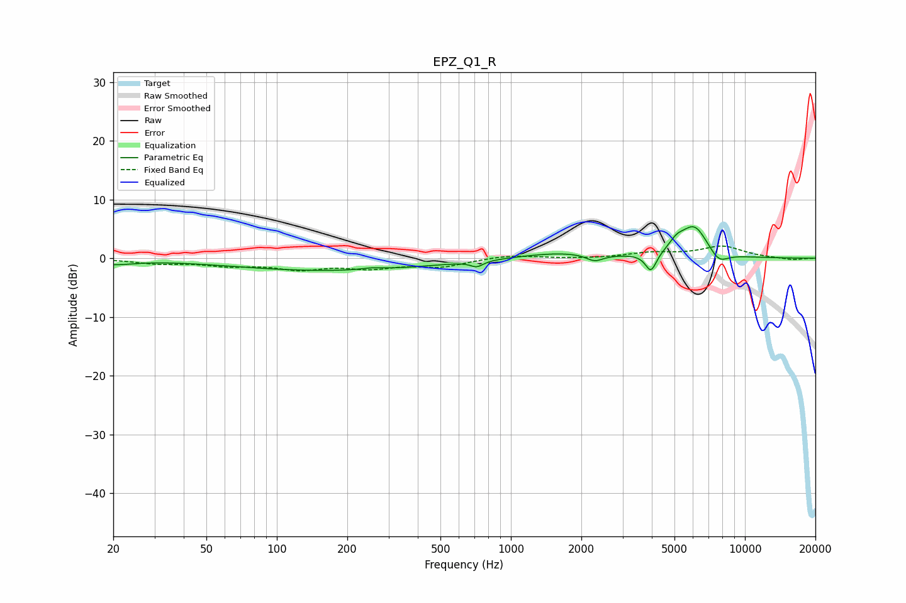

# EPZ_Q1_R
See [usage instructions](https://github.com/jaakkopasanen/AutoEq#usage) for more options and info.

### Parametric EQs
Apply preamp of -5.5 dB when using parametric equalizer.

|   # | Type    |   Fc (Hz) |    Q |   Gain (dB) |
|-----|---------|-----------|------|-------------|
|   1 | Peaking |        20 | 1.61 |        -0.9 |
|   2 | Peaking |       172 | 0.33 |        -2.1 |
|   3 | Peaking |       255 | 3.1  |         0.3 |
|   4 | Peaking |       716 | 5.3  |        -1   |
|   5 | Peaking |      1617 | 0.8  |         1   |
|   6 | Peaking |      2281 | 3.91 |        -1.2 |
|   7 | Peaking |      3967 | 6    |        -3.2 |
|   8 | Peaking |      5102 | 4.31 |         1.5 |
|   9 | Peaking |      6075 | 2.35 |         5.4 |
|  10 | Peaking |      7721 | 3.34 |        -2   |

### Fixed Band EQs
When using fixed band (also called graphic) equalizer, apply preamp of **-2.2 dB** (if available) and set gains manually with these parameters.

|   # | Type    |   Fc (Hz) |    Q |   Gain (dB) |
|-----|---------|-----------|------|-------------|
|   1 | Peaking |        31 | 1.41 |        -0.8 |
|   2 | Peaking |        62 | 1.41 |        -1.1 |
|   3 | Peaking |       125 | 1.41 |        -1.6 |
|   4 | Peaking |       250 | 1.41 |        -1.4 |
|   5 | Peaking |       500 | 1.41 |        -1.3 |
|   6 | Peaking |      1000 | 1.41 |         0.6 |
|   7 | Peaking |      2000 | 1.41 |        -0.1 |
|   8 | Peaking |      4000 | 1.41 |         0.8 |
|   9 | Peaking |      8000 | 1.41 |         2   |
|  10 | Peaking |     16000 | 1.41 |        -0.3 |

### Graphs

