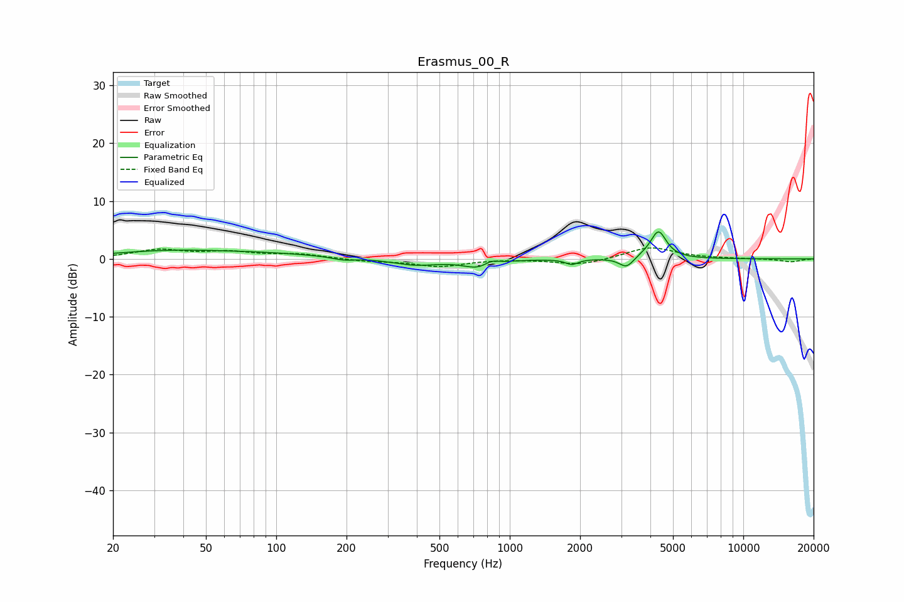

# Erasmus_00_R
See [usage instructions](https://github.com/jaakkopasanen/AutoEq#usage) for more options and info.

### Parametric EQs
Apply preamp of -4.8 dB when using parametric equalizer.

|   # | Type    |   Fc (Hz) |    Q |   Gain (dB) |
|-----|---------|-----------|------|-------------|
|   1 | Peaking |        35 | 0.56 |         1.3 |
|   2 | Peaking |        94 | 0.6  |         0.7 |
|   3 | Peaking |       194 | 3.06 |        -0.5 |
|   4 | Peaking |       393 | 1.47 |        -1.1 |
|   5 | Peaking |       740 | 2.17 |        -1.5 |
|   6 | Peaking |       832 | 4.46 |         0.9 |
|   7 | Peaking |      1845 | 5.32 |        -0.9 |
|   8 | Peaking |      3164 | 4.51 |        -1.9 |
|   9 | Peaking |      3924 | 2.12 |         0.5 |
|  10 | Peaking |      4335 | 4.29 |         4.5 |

### Fixed Band EQs
When using fixed band (also called graphic) equalizer, apply preamp of **-2.0 dB** (if available) and set gains manually with these parameters.

|   # | Type    |   Fc (Hz) |    Q |   Gain (dB) |
|-----|---------|-----------|------|-------------|
|   1 | Peaking |        31 | 1.41 |         1.5 |
|   2 | Peaking |        62 | 1.41 |         1   |
|   3 | Peaking |       125 | 1.41 |         0.8 |
|   4 | Peaking |       250 | 1.41 |        -0.4 |
|   5 | Peaking |       500 | 1.41 |        -1.3 |
|   6 | Peaking |      1000 | 1.41 |         0   |
|   7 | Peaking |      2000 | 1.41 |        -1.1 |
|   8 | Peaking |      4000 | 1.41 |         2.1 |
|   9 | Peaking |      8000 | 1.41 |         0   |
|  10 | Peaking |     16000 | 1.41 |        -0.5 |

### Graphs

