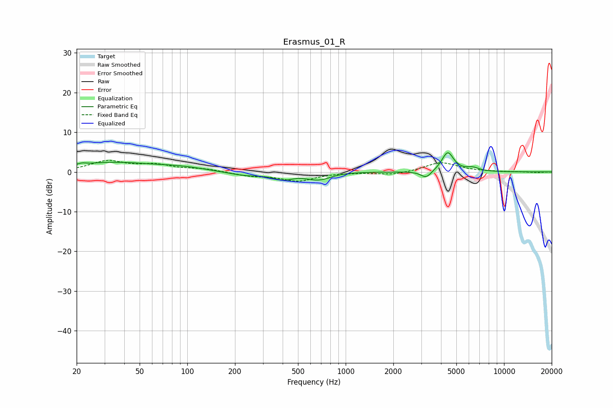

# Erasmus_01_R
See [usage instructions](https://github.com/jaakkopasanen/AutoEq#usage) for more options and info.

### Parametric EQs
Apply preamp of -4.9 dB when using parametric equalizer.

|   # | Type    |   Fc (Hz) |    Q |   Gain (dB) |
|-----|---------|-----------|------|-------------|
|   1 | Peaking |        22 | 5.87 |         0.4 |
|   2 | Peaking |        33 | 0.56 |         2.3 |
|   3 | Peaking |        91 | 0.88 |         0.9 |
|   4 | Peaking |       236 | 1.18 |        -1   |
|   5 | Peaking |       403 | 2.36 |        -1.5 |
|   6 | Peaking |       681 | 1.62 |        -2.5 |
|   7 | Peaking |       737 | 1.12 |         0.8 |
|   8 | Peaking |      3227 | 4.2  |        -1.8 |
|   9 | Peaking |      4410 | 3.78 |         4.9 |
|  10 | Peaking |      6356 | 3.48 |         0.9 |

### Fixed Band EQs
When using fixed band (also called graphic) equalizer, apply preamp of **-3.0 dB** (if available) and set gains manually with these parameters.

|   # | Type    |   Fc (Hz) |    Q |   Gain (dB) |
|-----|---------|-----------|------|-------------|
|   1 | Peaking |        31 | 1.41 |         2.6 |
|   2 | Peaking |        62 | 1.41 |         1.6 |
|   3 | Peaking |       125 | 1.41 |         0.7 |
|   4 | Peaking |       250 | 1.41 |        -0.9 |
|   5 | Peaking |       500 | 1.41 |        -2.2 |
|   6 | Peaking |      1000 | 1.41 |        -0.1 |
|   7 | Peaking |      2000 | 1.41 |        -0.8 |
|   8 | Peaking |      4000 | 1.41 |         2.4 |
|   9 | Peaking |      8000 | 1.41 |         0   |
|  10 | Peaking |     16000 | 1.41 |        -0.2 |

### Graphs

