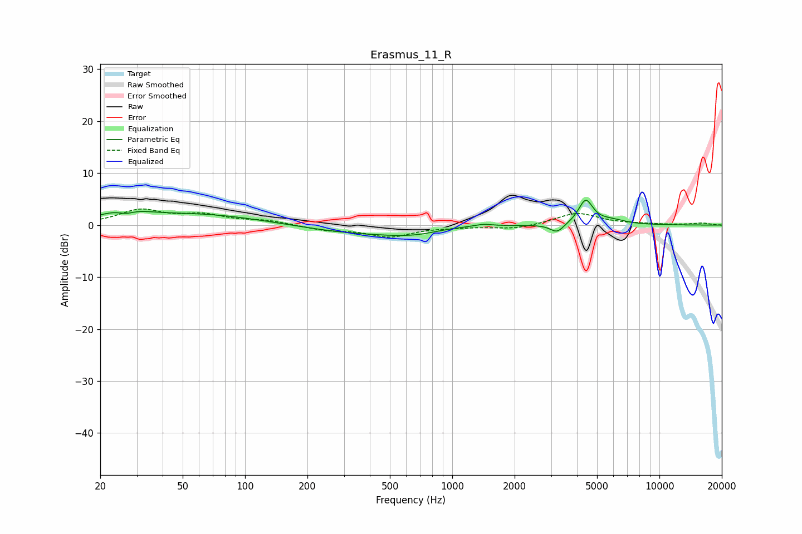

# Erasmus_11_R
See [usage instructions](https://github.com/jaakkopasanen/AutoEq#usage) for more options and info.

### Parametric EQs
Apply preamp of -4.9 dB when using parametric equalizer.

|   # | Type    |   Fc (Hz) |    Q |   Gain (dB) |
|-----|---------|-----------|------|-------------|
|   1 | Peaking |        26 | 1.48 |         2.3 |
|   2 | Peaking |        27 | 3.21 |        -1.3 |
|   3 | Peaking |        61 | 0.46 |         2.1 |
|   4 | Peaking |       331 | 0.54 |        -1.4 |
|   5 | Peaking |       694 | 0.9  |        -2.2 |
|   6 | Peaking |       834 | 0.86 |         1.3 |
|   7 | Peaking |      1408 | 3.37 |         0.4 |
|   8 | Peaking |      3207 | 4.29 |        -1.7 |
|   9 | Peaking |      4406 | 4.05 |         4.7 |
|  10 | Peaking |      5913 | 2.02 |         0.8 |

### Fixed Band EQs
When using fixed band (also called graphic) equalizer, apply preamp of **-3.2 dB** (if available) and set gains manually with these parameters.

|   # | Type    |   Fc (Hz) |    Q |   Gain (dB) |
|-----|---------|-----------|------|-------------|
|   1 | Peaking |        31 | 1.41 |         2.8 |
|   2 | Peaking |        62 | 1.41 |         1.7 |
|   3 | Peaking |       125 | 1.41 |         0.8 |
|   4 | Peaking |       250 | 1.41 |        -0.9 |
|   5 | Peaking |       500 | 1.41 |        -2.1 |
|   6 | Peaking |      1000 | 1.41 |        -0.2 |
|   7 | Peaking |      2000 | 1.41 |        -0.8 |
|   8 | Peaking |      4000 | 1.41 |         2.3 |
|   9 | Peaking |      8000 | 1.41 |         0.1 |
|  10 | Peaking |     16000 | 1.41 |         0.4 |

### Graphs

