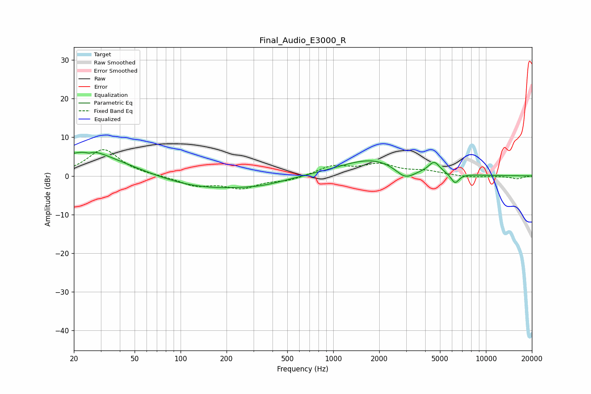

# Final_Audio_E3000_R
See [usage instructions](https://github.com/jaakkopasanen/AutoEq#usage) for more options and info.

### Parametric EQs
Apply preamp of -6.2 dB when using parametric equalizer.

|   # | Type    |   Fc (Hz) |    Q |   Gain (dB) |
|-----|---------|-----------|------|-------------|
|   1 | Peaking |        24 | 0.4  |         5.4 |
|   2 | Peaking |        26 | 5.64 |        -2.9 |
|   3 | Peaking |        26 | 5.61 |         2.5 |
|   4 | Peaking |        26 | 1.34 |         1.7 |
|   5 | Peaking |       141 | 0.4  |        -3.6 |
|   6 | Peaking |       346 | 1    |        -0.9 |
|   7 | Peaking |      1827 | 0.64 |         4.5 |
|   8 | Peaking |      2959 | 2.13 |        -3.3 |
|   9 | Peaking |      4583 | 3.86 |         2.8 |
|  10 | Peaking |      6274 | 5.03 |        -2.6 |

### Fixed Band EQs
When using fixed band (also called graphic) equalizer, apply preamp of **-6.9 dB** (if available) and set gains manually with these parameters.

|   # | Type    |   Fc (Hz) |    Q |   Gain (dB) |
|-----|---------|-----------|------|-------------|
|   1 | Peaking |        31 | 1.41 |         6.9 |
|   2 | Peaking |        62 | 1.41 |        -0   |
|   3 | Peaking |       125 | 1.41 |        -2.4 |
|   4 | Peaking |       250 | 1.41 |        -2.9 |
|   5 | Peaking |       500 | 1.41 |        -1.1 |
|   6 | Peaking |      1000 | 1.41 |         2.5 |
|   7 | Peaking |      2000 | 1.41 |         2.7 |
|   8 | Peaking |      4000 | 1.41 |         1.1 |
|   9 | Peaking |      8000 | 1.41 |        -0.4 |
|  10 | Peaking |     16000 | 1.41 |        -0.7 |

### Graphs

