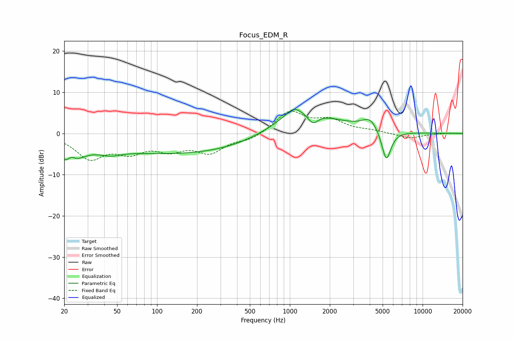

# Focus_EDM_R
See [usage instructions](https://github.com/jaakkopasanen/AutoEq#usage) for more options and info.

### Parametric EQs
Apply preamp of -5.9 dB when using parametric equalizer.

|   # | Type    |   Fc (Hz) |    Q |   Gain (dB) |
|-----|---------|-----------|------|-------------|
|   1 | Peaking |        22 | 1.58 |        -6   |
|   2 | Peaking |        23 | 4.76 |         1.9 |
|   3 | Peaking |        44 | 1.73 |        -1.4 |
|   4 | Peaking |       175 | 0.19 |        -5.1 |
|   5 | Peaking |      1066 | 2.34 |         2.3 |
|   6 | Peaking |      1134 | 0.98 |        -0   |
|   7 | Peaking |      1218 | 0.53 |         6.2 |
|   8 | Peaking |      1491 | 3.58 |        -2.5 |
|   9 | Peaking |      4030 | 2.34 |         2.9 |
|  10 | Peaking |      5327 | 3.88 |        -7.8 |

### Fixed Band EQs
When using fixed band (also called graphic) equalizer, apply preamp of **-5.5 dB** (if available) and set gains manually with these parameters.

|   # | Type    |   Fc (Hz) |    Q |   Gain (dB) |
|-----|---------|-----------|------|-------------|
|   1 | Peaking |        31 | 1.41 |        -5.7 |
|   2 | Peaking |        62 | 1.41 |        -3.8 |
|   3 | Peaking |       125 | 1.41 |        -3.3 |
|   4 | Peaking |       250 | 1.41 |        -4.2 |
|   5 | Peaking |       500 | 1.41 |        -1.5 |
|   6 | Peaking |      1000 | 1.41 |         5.3 |
|   7 | Peaking |      2000 | 1.41 |         2.9 |
|   8 | Peaking |      4000 | 1.41 |         0.5 |
|   9 | Peaking |      8000 | 1.41 |        -1.2 |
|  10 | Peaking |     16000 | 1.41 |         0.1 |

### Graphs

