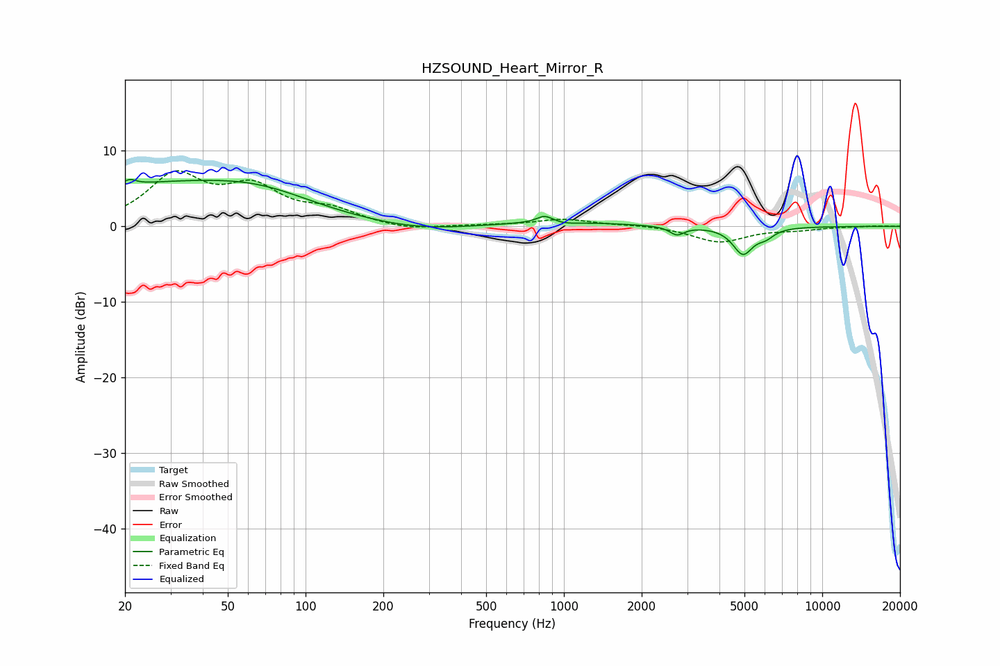

# HZSOUND_Heart_Mirror_R
See [usage instructions](https://github.com/jaakkopasanen/AutoEq#usage) for more options and info.

### Parametric EQs
Apply preamp of -6.3 dB when using parametric equalizer.

|   # | Type    |   Fc (Hz) |    Q |   Gain (dB) |
|-----|---------|-----------|------|-------------|
|   1 | Peaking |        21 | 5.85 |         0.8 |
|   2 | Peaking |        27 | 0.33 |         5.2 |
|   3 | Peaking |        68 | 0.68 |         2.1 |
|   4 | Peaking |       274 | 0.75 |        -0.8 |
|   5 | Peaking |       843 | 4.59 |         0.9 |
|   6 | Peaking |       959 | 0.63 |         0.6 |
|   7 | Peaking |      1015 | 2.86 |        -0.3 |
|   8 | Peaking |      2740 | 5.1  |        -1.1 |
|   9 | Peaking |      4932 | 3.58 |        -3.5 |
|  10 | Peaking |      6040 | 4.21 |        -1   |

### Fixed Band EQs
When using fixed band (also called graphic) equalizer, apply preamp of **-7.4 dB** (if available) and set gains manually with these parameters.

|   # | Type    |   Fc (Hz) |    Q |   Gain (dB) |
|-----|---------|-----------|------|-------------|
|   1 | Peaking |        31 | 1.41 |         6.4 |
|   2 | Peaking |        62 | 1.41 |         4.5 |
|   3 | Peaking |       125 | 1.41 |         1.9 |
|   4 | Peaking |       250 | 1.41 |        -0.6 |
|   5 | Peaking |       500 | 1.41 |         0.1 |
|   6 | Peaking |      1000 | 1.41 |         0.9 |
|   7 | Peaking |      2000 | 1.41 |         0.2 |
|   8 | Peaking |      4000 | 1.41 |        -2.1 |
|   9 | Peaking |      8000 | 1.41 |        -0.4 |
|  10 | Peaking |     16000 | 1.41 |         0.1 |

### Graphs

