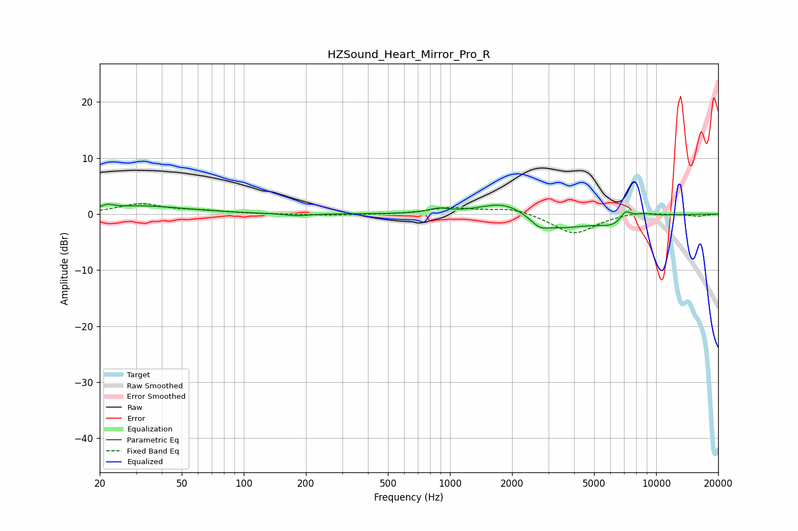

# HZSound_Heart_Mirror_Pro_R
See [usage instructions](https://github.com/jaakkopasanen/AutoEq#usage) for more options and info.

### Parametric EQs
Apply preamp of -1.9 dB when using parametric equalizer.

|   # | Type    |   Fc (Hz) |    Q |   Gain (dB) |
|-----|---------|-----------|------|-------------|
|   1 | Peaking |        22 | 5.66 |         0.6 |
|   2 | Peaking |        31 | 0.62 |         1.4 |
|   3 | Peaking |       180 | 2.39 |        -0.4 |
|   4 | Peaking |       880 | 3.04 |         0.8 |
|   5 | Peaking |      1855 | 1.18 |         2.8 |
|   6 | Peaking |      2722 | 3.54 |        -1.3 |
|   7 | Peaking |      3300 | 0.91 |        -2.8 |
|   8 | Peaking |      6239 | 1.86 |        -1.5 |
|   9 | Peaking |      7107 | 4.99 |         1.8 |
|  10 | Peaking |      8559 | 2.57 |         0.7 |

### Fixed Band EQs
When using fixed band (also called graphic) equalizer, apply preamp of **-1.9 dB** (if available) and set gains manually with these parameters.

|   # | Type    |   Fc (Hz) |    Q |   Gain (dB) |
|-----|---------|-----------|------|-------------|
|   1 | Peaking |        31 | 1.41 |         1.8 |
|   2 | Peaking |        62 | 1.41 |         0.5 |
|   3 | Peaking |       125 | 1.41 |        -0   |
|   4 | Peaking |       250 | 1.41 |        -0.2 |
|   5 | Peaking |       500 | 1.41 |        -0.1 |
|   6 | Peaking |      1000 | 1.41 |         1.1 |
|   7 | Peaking |      2000 | 1.41 |         1.1 |
|   8 | Peaking |      4000 | 1.41 |        -3.6 |
|   9 | Peaking |      8000 | 1.41 |         0.5 |
|  10 | Peaking |     16000 | 1.41 |        -0.4 |

### Graphs

