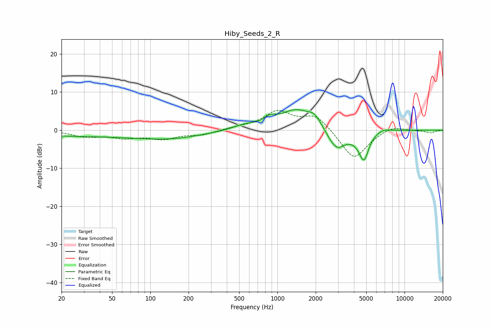

# Hiby_Seeds_2_R
See [usage instructions](https://github.com/jaakkopasanen/AutoEq#usage) for more options and info.

### Parametric EQs
Apply preamp of -5.5 dB when using parametric equalizer.

|   # | Type    |   Fc (Hz) |    Q |   Gain (dB) |
|-----|---------|-----------|------|-------------|
|   1 | Peaking |        33 | 0.18 |        -1.5 |
|   2 | Peaking |       151 | 0.58 |        -1.4 |
|   3 | Peaking |       554 | 1.45 |         1.1 |
|   4 | Peaking |       870 | 3.24 |         1.5 |
|   5 | Peaking |      1397 | 1.08 |         5.3 |
|   6 | Peaking |      1961 | 2.73 |         2.4 |
|   7 | Peaking |      2905 | 2.01 |        -5.5 |
|   8 | Peaking |      4820 | 3.08 |       -10.3 |
|   9 | Peaking |      4989 | 2.87 |         2.7 |
|  10 | Peaking |      6610 | 1.93 |         1.1 |

### Fixed Band EQs
When using fixed band (also called graphic) equalizer, apply preamp of **-5.3 dB** (if available) and set gains manually with these parameters.

|   # | Type    |   Fc (Hz) |    Q |   Gain (dB) |
|-----|---------|-----------|------|-------------|
|   1 | Peaking |        31 | 1.41 |        -1.6 |
|   2 | Peaking |        62 | 1.41 |        -1.7 |
|   3 | Peaking |       125 | 1.41 |        -2   |
|   4 | Peaking |       250 | 1.41 |        -1.2 |
|   5 | Peaking |       500 | 1.41 |         0.6 |
|   6 | Peaking |      1000 | 1.41 |         4.7 |
|   7 | Peaking |      2000 | 1.41 |         4   |
|   8 | Peaking |      4000 | 1.41 |        -7.9 |
|   9 | Peaking |      8000 | 1.41 |         1.4 |
|  10 | Peaking |     16000 | 1.41 |        -0.7 |

### Graphs

