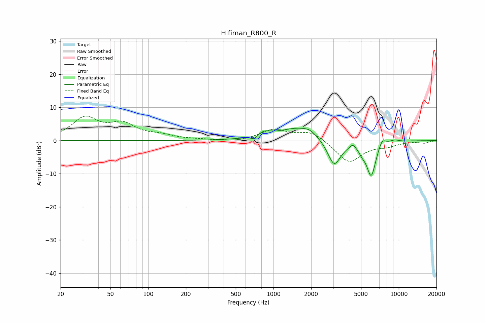

# Hifiman_R800_R
See [usage instructions](https://github.com/jaakkopasanen/AutoEq#usage) for more options and info.

### Parametric EQs
Apply preamp of -3.8 dB when using parametric equalizer.

|   # | Type    |   Fc (Hz) |    Q |   Gain (dB) |
|-----|---------|-----------|------|-------------|
|   1 | Peaking |       705 | 5.03 |        -1.4 |
|   2 | Peaking |       827 | 2.39 |         1.7 |
|   3 | Peaking |      1583 | 0.9  |         3.8 |
|   4 | Peaking |      1952 | 2.77 |         1.1 |
|   5 | Peaking |      3049 | 2.59 |        -8.2 |
|   6 | Peaking |      4293 | 6    |         1.4 |
|   7 | Peaking |      5096 | 6    |        -1.2 |
|   8 | Peaking |      6024 | 3.44 |       -10.8 |
|   9 | Peaking |      7341 | 4.39 |         2.7 |
|  10 | Peaking |      9214 | 3.23 |         0.7 |

### Fixed Band EQs
When using fixed band (also called graphic) equalizer, apply preamp of **-7.5 dB** (if available) and set gains manually with these parameters.

|   # | Type    |   Fc (Hz) |    Q |   Gain (dB) |
|-----|---------|-----------|------|-------------|
|   1 | Peaking |        31 | 1.41 |         6.5 |
|   2 | Peaking |        62 | 1.41 |         4.4 |
|   3 | Peaking |       125 | 1.41 |         1.3 |
|   4 | Peaking |       250 | 1.41 |         0.2 |
|   5 | Peaking |       500 | 1.41 |        -0.5 |
|   6 | Peaking |      1000 | 1.41 |         3.2 |
|   7 | Peaking |      2000 | 1.41 |         2.8 |
|   8 | Peaking |      4000 | 1.41 |        -6.6 |
|   9 | Peaking |      8000 | 1.41 |        -1.3 |
|  10 | Peaking |     16000 | 1.41 |        -0.7 |

### Graphs

