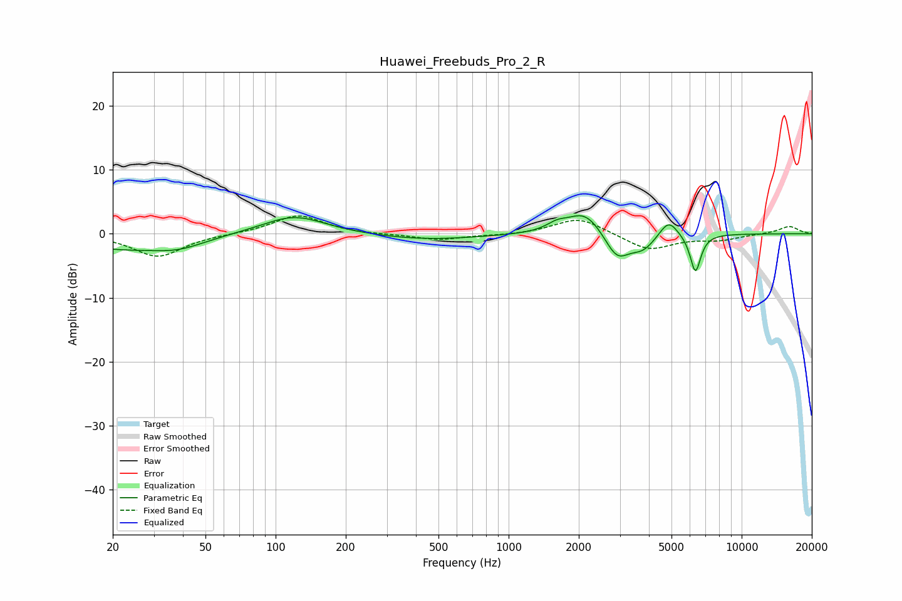

# Huawei_Freebuds_Pro_2_R
See [usage instructions](https://github.com/jaakkopasanen/AutoEq#usage) for more options and info.

### Parametric EQs
Apply preamp of -2.9 dB when using parametric equalizer.

|   # | Type    |   Fc (Hz) |    Q |   Gain (dB) |
|-----|---------|-----------|------|-------------|
|   1 | Peaking |        21 | 0.63 |        -2.2 |
|   2 | Peaking |        38 | 1.27 |        -1.4 |
|   3 | Peaking |       120 | 1.04 |         3   |
|   4 | Peaking |       437 | 0.61 |        -1   |
|   5 | Peaking |      1608 | 3.22 |         1   |
|   6 | Peaking |      2127 | 1.86 |         3.7 |
|   7 | Peaking |      2918 | 2.63 |        -4.2 |
|   8 | Peaking |      3774 | 2.6  |        -2.2 |
|   9 | Peaking |      4855 | 3.55 |         2.7 |
|  10 | Peaking |      6333 | 6    |        -6   |

### Fixed Band EQs
When using fixed band (also called graphic) equalizer, apply preamp of **-2.9 dB** (if available) and set gains manually with these parameters.

|   # | Type    |   Fc (Hz) |    Q |   Gain (dB) |
|-----|---------|-----------|------|-------------|
|   1 | Peaking |        31 | 1.41 |        -3.6 |
|   2 | Peaking |        62 | 1.41 |        -0   |
|   3 | Peaking |       125 | 1.41 |         2.9 |
|   4 | Peaking |       250 | 1.41 |        -0.1 |
|   5 | Peaking |       500 | 1.41 |        -1   |
|   6 | Peaking |      1000 | 1.41 |        -0.2 |
|   7 | Peaking |      2000 | 1.41 |         2.6 |
|   8 | Peaking |      4000 | 1.41 |        -2.6 |
|   9 | Peaking |      8000 | 1.41 |        -0.9 |
|  10 | Peaking |     16000 | 1.41 |         1.2 |

### Graphs

