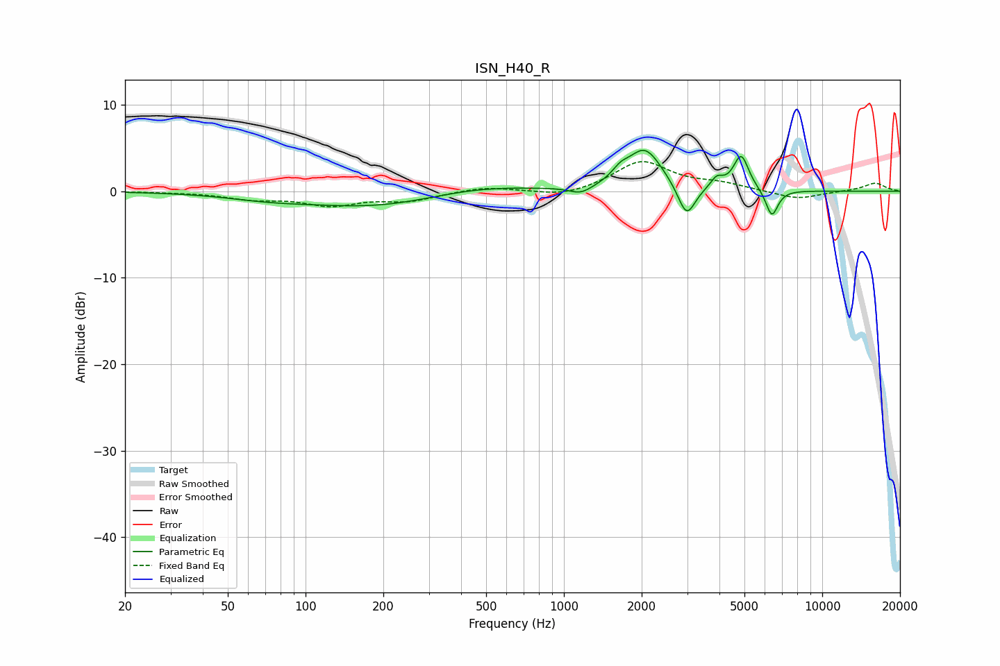

# ISN_H40_R
See [usage instructions](https://github.com/jaakkopasanen/AutoEq#usage) for more options and info.

### Parametric EQs
Apply preamp of -4.8 dB when using parametric equalizer.

|   # | Type    |   Fc (Hz) |    Q |   Gain (dB) |
|-----|---------|-----------|------|-------------|
|   1 | Peaking |        73 | 0.83 |        -0.7 |
|   2 | Peaking |       188 | 0.56 |        -1.7 |
|   3 | Peaking |       468 | 0.68 |         0.8 |
|   4 | Peaking |      1164 | 3.16 |        -0.9 |
|   5 | Peaking |      1653 | 4.48 |         1   |
|   6 | Peaking |      2056 | 2.09 |         4.8 |
|   7 | Peaking |      2985 | 4.18 |        -3.8 |
|   8 | Peaking |      3909 | 5.99 |         1.2 |
|   9 | Peaking |      4853 | 4.71 |         4   |
|  10 | Peaking |      6382 | 5.83 |        -3.2 |

### Fixed Band EQs
When using fixed band (also called graphic) equalizer, apply preamp of **-3.5 dB** (if available) and set gains manually with these parameters.

|   # | Type    |   Fc (Hz) |    Q |   Gain (dB) |
|-----|---------|-----------|------|-------------|
|   1 | Peaking |        31 | 1.41 |        -0.1 |
|   2 | Peaking |        62 | 1.41 |        -0.8 |
|   3 | Peaking |       125 | 1.41 |        -1.5 |
|   4 | Peaking |       250 | 1.41 |        -1   |
|   5 | Peaking |       500 | 1.41 |         0.6 |
|   6 | Peaking |      1000 | 1.41 |        -0.7 |
|   7 | Peaking |      2000 | 1.41 |         3.4 |
|   8 | Peaking |      4000 | 1.41 |         0.7 |
|   9 | Peaking |      8000 | 1.41 |        -1   |
|  10 | Peaking |     16000 | 1.41 |         1   |

### Graphs

