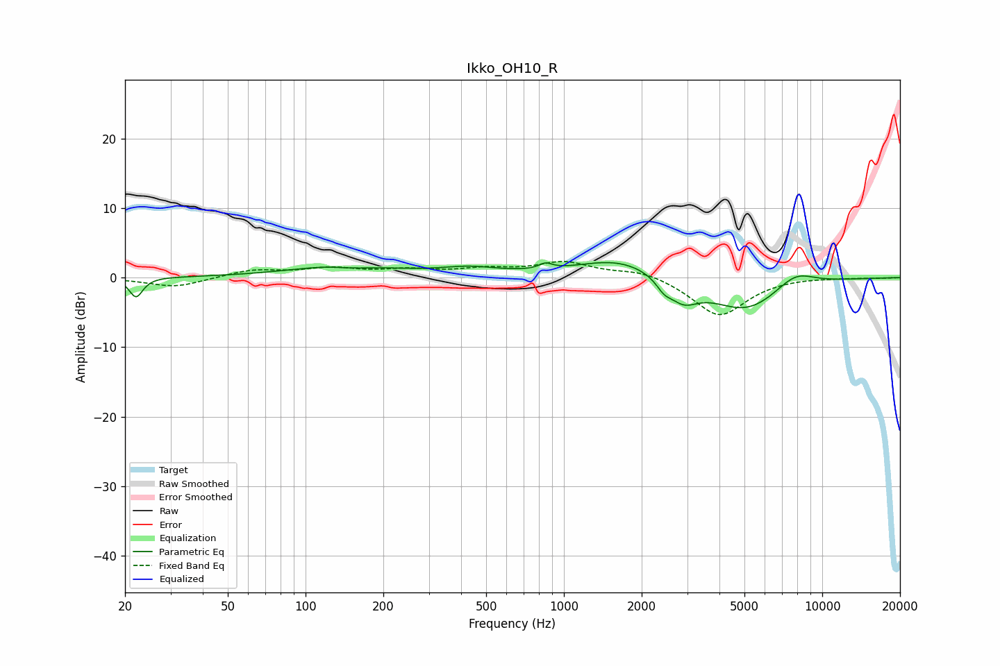

# Ikko_OH10_R
See [usage instructions](https://github.com/jaakkopasanen/AutoEq#usage) for more options and info.

### Parametric EQs
Apply preamp of -2.3 dB when using parametric equalizer.

|   # | Type    |   Fc (Hz) |    Q |   Gain (dB) |
|-----|---------|-----------|------|-------------|
|   1 | Peaking |        22 | 5.62 |        -2.8 |
|   2 | Peaking |       141 | 0.71 |         1.8 |
|   3 | Peaking |       153 | 1.87 |        -0.5 |
|   4 | Peaking |       432 | 1.24 |         1.1 |
|   5 | Peaking |       850 | 5.57 |         0.8 |
|   6 | Peaking |      1655 | 0.85 |         2.9 |
|   7 | Peaking |      2439 | 4.92 |        -1.3 |
|   8 | Peaking |      2887 | 2.41 |        -3.1 |
|   9 | Peaking |      5058 | 0.96 |        -4.9 |
|  10 | Peaking |      7843 | 1.7  |         2.4 |

### Fixed Band EQs
When using fixed band (also called graphic) equalizer, apply preamp of **-2.4 dB** (if available) and set gains manually with these parameters.

|   # | Type    |   Fc (Hz) |    Q |   Gain (dB) |
|-----|---------|-----------|------|-------------|
|   1 | Peaking |        31 | 1.41 |        -1.4 |
|   2 | Peaking |        62 | 1.41 |         1.1 |
|   3 | Peaking |       125 | 1.41 |         1.2 |
|   4 | Peaking |       250 | 1.41 |         0.9 |
|   5 | Peaking |       500 | 1.41 |         1   |
|   6 | Peaking |      1000 | 1.41 |         2.1 |
|   7 | Peaking |      2000 | 1.41 |         1.1 |
|   8 | Peaking |      4000 | 1.41 |        -5.6 |
|   9 | Peaking |      8000 | 1.41 |         0.1 |
|  10 | Peaking |     16000 | 1.41 |        -0.1 |

### Graphs

